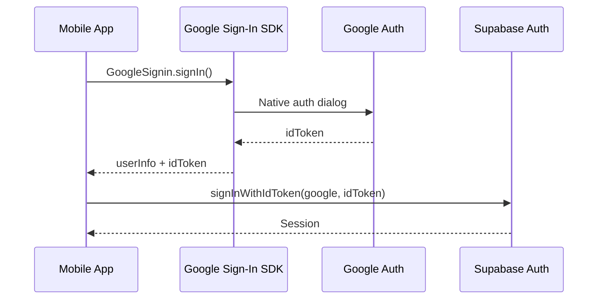

# Mobile Google OAuth Implementation

## Problem

The current implementation uses `expo-web-browser` to open a web-based OAuth flow, which redirects through the web app. For a proper mobile experience, we need native Google Sign-In.

## Prerequisites

Before implementing, verify:

1. **Supabase Dashboard**: Google provider is enabled under Authentication > Providers > Google
2. **Google Cloud Console**:

   - iOS OAuth Client exists with Bundle ID: `com.myteamnetwork.teammeet`
   - Web OAuth Client ID matches the one configured in Supabase's Google provider

3. **Environment**: You have both the iOS Client ID and Web Client ID ready

## Solution Architecture



## Implementation Steps

### 1. Install Native Google Sign-In Package

```bash
cd apps/mobile
bun add @react-native-google-signin/google-signin
```

### 2. Configure app.json for Google Sign-In

Add the config plugin in [apps/mobile/app.json](apps/mobile/app.json):

```json
{
  "expo": {
    "plugins": [
      "@react-native-google-signin/google-signin"
    ],
    "ios": {
      "infoPlist": {
        "CFBundleURLTypes": [{
          "CFBundleURLSchemes": ["com.googleusercontent.apps.YOUR_IOS_CLIENT_ID"]
        }]
      }
    }
  }
}
```

Replace `YOUR_IOS_CLIENT_ID` with the reversed client ID from your iOS OAuth credential (e.g., if client ID is `123456.apps.googleusercontent.com`, the scheme is `com.googleusercontent.apps.123456`).

### 3. Update Login Screen

Modify [apps/mobile/app/(auth)/login.tsx](apps/mobile/app/\(auth)/login.tsx):

- Import and configure `GoogleSignin` from `@react-native-google-signin/google-signin`
- Replace the `signInWithOAuth` flow with native `GoogleSignin.signIn()`
- Use `supabase.auth.signInWithIdToken()` with the Google ID token
- Remove or keep `expo-web-browser` imports as fallback (optional)

Key code pattern:

```typescript
import { Platform } from "react-native";
import {
  GoogleSignin,
  statusCodes,
} from "@react-native-google-signin/google-signin";

// Configure once (in useEffect or at module level)
GoogleSignin.configure({
  iosClientId: process.env.EXPO_PUBLIC_GOOGLE_IOS_CLIENT_ID,
  webClientId: process.env.EXPO_PUBLIC_GOOGLE_WEB_CLIENT_ID, // Required for ID token
});

// Sign in handler
const signInWithGoogle = async () => {
  setGoogleLoading(true);
  try {
    // hasPlayServices is Android-only
    if (Platform.OS === "android") {
      await GoogleSignin.hasPlayServices();
    }
    
    const userInfo = await GoogleSignin.signIn();

    if (userInfo.data?.idToken) {
      const { error } = await supabase.auth.signInWithIdToken({
        provider: "google",
        token: userInfo.data.idToken,
      });
      
      if (error) throw error;
      // Navigation happens automatically via _layout.tsx onAuthStateChange
    } else {
      throw new Error("No ID token received from Google");
    }
  } catch (error: any) {
    if (error.code === statusCodes.SIGN_IN_CANCELLED) {
      // User cancelled - do nothing
    } else if (error.code === statusCodes.IN_PROGRESS) {
      // Sign in already in progress
    } else if (error.code === statusCodes.PLAY_SERVICES_NOT_AVAILABLE) {
      showAlert("Error", "Google Play Services not available");
    } else {
      showAlert("Error", error.message || "Google sign-in failed");
    }
  } finally {
    setGoogleLoading(false);
  }
};
```

### 4. Add Environment Variables

In `apps/mobile/.env.local`, ensure you have:

```
EXPO_PUBLIC_GOOGLE_IOS_CLIENT_ID=your-ios-client-id.apps.googleusercontent.com
EXPO_PUBLIC_GOOGLE_WEB_CLIENT_ID=your-web-client-id.apps.googleusercontent.com
```

**Important**: The `webClientId` is required to get an ID token from Google Sign-In. This should be your existing web OAuth client ID from Google Cloud Console (the same one Supabase uses).

### 5. Cleanup Old OAuth Code

In `login.tsx`, you can remove or comment out:

- `import { makeRedirectUri } from "expo-auth-session"`
- `import * as WebBrowser from "expo-web-browser"`
- `WebBrowser.maybeCompleteAuthSession()` call
- The `isExpoGo` and `isWeb` checks (native sign-in works in dev builds)

Keep `expo-linking` if used elsewhere in the app.

### 6. Rebuild the Development Client

After modifying `app.json` with the new plugin, rebuild:

```bash
cd apps/mobile
npx expo prebuild --clean
npx expo run:ios
```

## Google Cloud Console Requirements

Verify in [Google Cloud Console](https://console.cloud.google.com/apis/credentials):

1. **iOS OAuth Client**:

   - Bundle ID: `com.myteamnetwork.teammeet`
   - Must match `bundleIdentifier` in app.json exactly

2. **Web OAuth Client** (existing):

   - Used as `webClientId` to generate ID tokens
   - This must be the same Client ID configured in Supabase's Google provider settings
   - Authorized redirect URIs should include your Supabase callback

## Files to Modify

- [apps/mobile/app.json](apps/mobile/app.json) - Add Google Sign-In plugin and URL scheme
- [apps/mobile/app/(auth)/login.tsx](apps/mobile/app/\(auth)/login.tsx) - Replace OAuth flow with native sign-in
- `apps/mobile/.env.local` - Add `EXPO_PUBLIC_GOOGLE_WEB_CLIENT_ID`