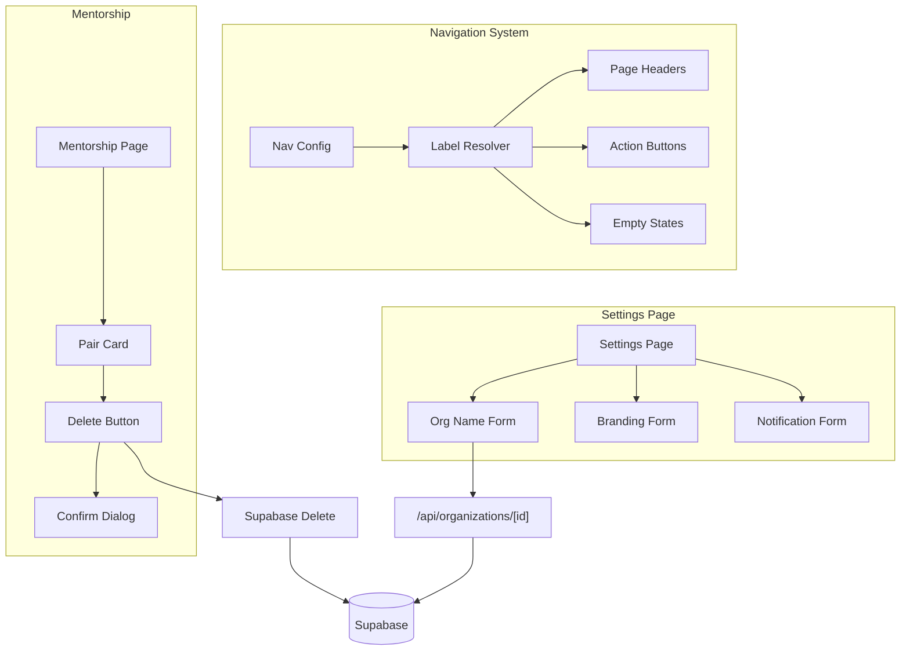

# Design Document: Admin Settings Enhancements

## Overview

This design covers enhancements to the organization settings and admin capabilities in TeamNetwork. The changes include:
1. Adding organization name editing for admins in the settings page
2. Propagating custom navigation labels throughout page content
3. Enabling admins to delete mentorship pairs
4. Updating the contact email to support@myteamnetwork.com
5. Optimizing whitespace in the settings UI

## Architecture

The implementation follows the existing Next.js App Router architecture with:
- Client components for interactive settings forms
- Server components for initial data fetching
- API routes for mutations
- Supabase for data persistence



## Components and Interfaces

### 1. Organization Name Editor

Extend the existing settings page to include an organization name field.

```typescript
// In src/app/[orgSlug]/settings/page.tsx
interface OrgNameEditorProps {
  orgId: string;
  currentName: string;
  isAdmin: boolean;
  onUpdate: (newName: string) => void;
}

// Validation function
function validateOrgName(name: string): { valid: boolean; error?: string } {
  const trimmed = name.trim();
  if (!trimmed) {
    return { valid: false, error: "Organization name cannot be empty" };
  }
  if (trimmed.length > 100) {
    return { valid: false, error: "Organization name must be under 100 characters" };
  }
  return { valid: true };
}
```

### 2. Label Resolver Utility

Create a utility to resolve labels from nav config with fallback to defaults.

```typescript
// In src/lib/navigation/label-resolver.ts
import { ORG_NAV_ITEMS, type NavConfig } from "./nav-items";

export function resolveLabel(
  href: string,
  navConfig: NavConfig | null | undefined
): string {
  const defaultItem = ORG_NAV_ITEMS.find((item) => item.href === href);
  const defaultLabel = defaultItem?.label ?? "";
  
  if (!navConfig || !navConfig[href]?.label) {
    return defaultLabel;
  }
  
  return navConfig[href].label || defaultLabel;
}

export function resolveActionLabel(
  href: string,
  navConfig: NavConfig | null | undefined,
  prefix: string = "Add"
): string {
  const label = resolveLabel(href, navConfig);
  // Convert plural to singular for action buttons
  const singular = label.endsWith("s") ? label.slice(0, -1) : label;
  return `${prefix} ${singular}`;
}
```

### 3. Mentorship Pair Delete Component

Add delete functionality to the mentorship admin panel.

```typescript
// In src/components/mentorship/MentorshipPairCard.tsx
interface MentorshipPairCardProps {
  pair: MentorshipPair;
  mentorLabel: string;
  menteeLabel: string;
  logs: MentorshipLog[];
  isAdmin: boolean;
  onDelete?: (pairId: string) => Promise<void>;
}
```

### 4. API Route Extension

Extend the existing organization API to handle name updates.

```typescript
// PATCH /api/organizations/[organizationId]
// Existing route already handles navConfig, extend to handle name
interface OrgUpdatePayload {
  navConfig?: NavConfig;
  name?: string;  // New field
}
```

## Data Models

### Organization Table (existing, no changes needed)
The `organizations` table already has a `name` column that we'll use.

### Mentorship Pairs Deletion
When deleting a mentorship pair, we need to cascade delete associated logs:

```sql
-- The mentorship_logs table should have ON DELETE CASCADE
-- If not, we'll delete logs first, then the pair
DELETE FROM mentorship_logs WHERE pair_id = $1;
DELETE FROM mentorship_pairs WHERE id = $1 AND organization_id = $2;
```

## Correctness Properties

*A property is a characteristic or behavior that should hold true across all valid executions of a system—essentially, a formal statement about what the system should do. Properties serve as the bridge between human-readable specifications and machine-verifiable correctness guarantees.*

### Property 1: Role-based Organization Name Editability

*For any* user viewing the settings page, the organization name field should be editable if and only if the user has the "admin" role.

**Validates: Requirements 1.1, 1.2**

### Property 2: Organization Name Validation

*For any* string submitted as an organization name, the validation function should return valid=true if and only if the trimmed string is non-empty and has length ≤ 100 characters.

**Validates: Requirements 1.3**

### Property 3: Organization Name Persistence Round-Trip

*For any* valid organization name, after an admin successfully updates the name, reading the organization from the database should return the same name value.

**Validates: Requirements 1.5**

### Property 4: Nav Label Resolution with Fallback

*For any* navigation href and nav config, the resolved label should equal the custom label if one exists in the config, otherwise it should equal the default label from ORG_NAV_ITEMS.

**Validates: Requirements 2.2, 2.3**

### Property 5: Mentorship Pair Deletion Cascade

*For any* mentorship pair, after successful deletion, querying for that pair by ID should return null, and querying for logs with that pair_id should return an empty array.

**Validates: Requirements 3.3**

### Property 6: Mentorship Deletion Authorization

*For any* user attempting to delete a mentorship pair, the operation should succeed if and only if the user has the "admin" role for that organization.

**Validates: Requirements 3.6**

## Error Handling

### Organization Name Update Errors
- Empty name: Display "Organization name cannot be empty"
- Name too long: Display "Organization name must be under 100 characters"
- Database error: Display "Unable to update organization name. Please try again."
- Unauthorized: Display "Only admins can change the organization name"

### Mentorship Deletion Errors
- Unauthorized: Display "Only admins can delete mentorship pairs"
- Not found: Display "Mentorship pair not found"
- Database error: Display "Unable to delete mentorship pair. Please try again."

### Label Resolution Errors
- Missing nav config: Fall back to default labels (no error displayed)
- Invalid config format: Fall back to default labels (log warning)

## Testing Strategy

### Unit Tests
- `validateOrgName()` function with various inputs (empty, whitespace, valid, too long)
- `resolveLabel()` function with various nav configs
- `resolveActionLabel()` function for singular/plural handling

### Property-Based Tests
Using a property-based testing library (e.g., fast-check for TypeScript):

1. **Property 1**: Generate random role values, verify editability matches admin status
2. **Property 2**: Generate random strings, verify validation matches length/empty rules
3. **Property 3**: Generate valid org names, verify round-trip persistence
4. **Property 4**: Generate random nav configs and hrefs, verify label resolution
5. **Property 5**: Create pairs with logs, delete, verify cascade
6. **Property 6**: Generate random roles, verify authorization

Each property test should run minimum 100 iterations.

### Integration Tests
- Settings page renders correctly for admin vs non-admin
- Organization name update flow end-to-end
- Mentorship pair deletion with confirmation
- Label propagation across pages

### Example Tests
- Contact email appears correctly on terms page
- Contact email appears correctly in landing page footer
- Delete button visible only for admins on mentorship page
