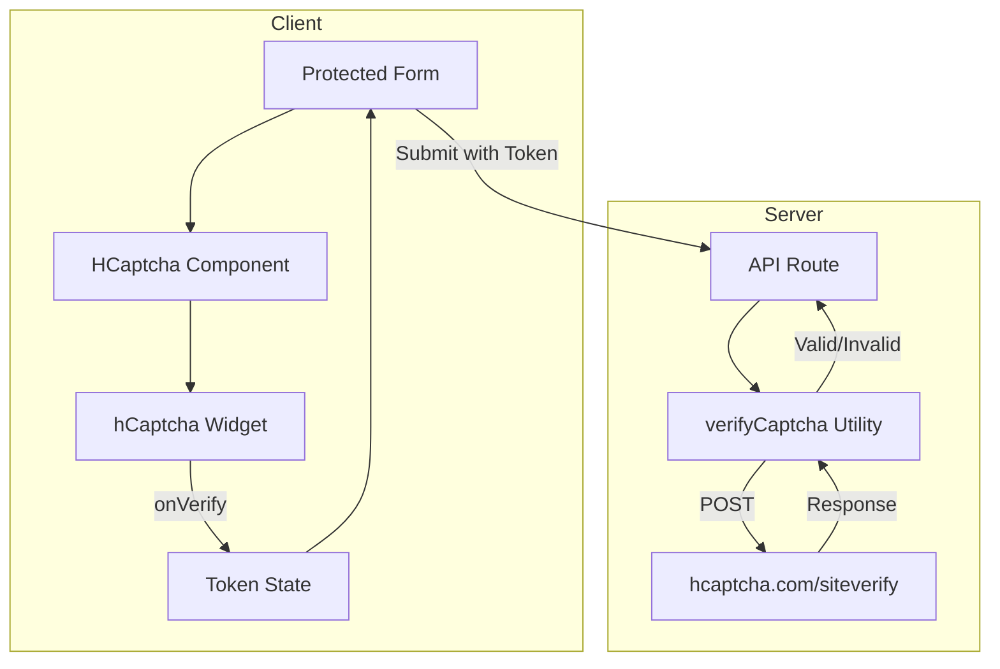

# Design Document: hCaptcha Integration

## Overview

This design document describes the implementation of hCaptcha bot protection for the TeamNetwork application. The integration consists of three main components:

1. A reusable React component wrapping the `@hcaptcha/react-hcaptcha` library
2. A server-side verification utility for validating captcha tokens
3. Integration into protected forms (login, signup, join, donation)

The design prioritizes minimal code changes to existing forms while providing robust protection against automated abuse.

## Architecture



## Components and Interfaces

### 1. HCaptcha React Component

Location: `src/components/ui/HCaptcha.tsx`

```typescript
interface HCaptchaProps {
  siteKey?: string;
  onVerify: (token: string) => void;
  onExpire?: () => void;
  onError?: (error: string) => void;
  theme?: "light" | "dark";
  size?: "normal" | "compact" | "invisible";
  className?: string;
}

interface HCaptchaRef {
  execute: () => void;
  reset: () => void;
}
```

The component wraps `@hcaptcha/react-hcaptcha` and provides:
- Automatic site key loading from environment
- Theme detection based on system/app preferences
- Loading state management
- Error boundary handling
- Ref forwarding for programmatic control

### 2. Server-Side Verification Utility

Location: `src/lib/security/captcha.ts`

```typescript
interface CaptchaVerifyResult {
  success: boolean;
  challenge_ts?: string;
  hostname?: string;
  credit?: boolean;
  error_codes?: string[];
}

interface CaptchaConfig {
  secretKey?: string;
  timeout?: number;
  skipInDevelopment?: boolean;
}

async function verifyCaptcha(
  token: string,
  remoteIp?: string,
  config?: CaptchaConfig
): Promise<CaptchaVerifyResult>
```

The utility:
- Sends POST request to `https://api.hcaptcha.com/siteverify`
- Includes secret key and optional remote IP
- Handles timeout (default 3 seconds)
- Returns structured result with error codes
- Supports development mode bypass

### 3. useCaptcha Hook

Location: `src/hooks/useCaptcha.ts`

```typescript
interface UseCaptchaReturn {
  token: string | null;
  isVerified: boolean;
  isLoading: boolean;
  error: string | null;
  onVerify: (token: string) => void;
  onExpire: () => void;
  onError: (error: string) => void;
  reset: () => void;
}

function useCaptcha(): UseCaptchaReturn
```

A custom hook that manages captcha state for forms:
- Tracks verification token
- Provides callback handlers for the HCaptcha component
- Manages loading and error states
- Provides reset functionality

## Data Models

### Environment Variables

```
# Client-side (public)
NEXT_PUBLIC_HCAPTCHA_SITE_KEY=your-site-key

# Server-side (secret)
HCAPTCHA_SECRET_KEY=your-secret-key
```

### API Request/Response

Protected endpoints will expect a `captchaToken` field in the request body:

```typescript
// Request body extension
interface ProtectedRequest {
  captchaToken: string;
  // ... other fields
}

// Validation schema extension
const protectedSchema = z.object({
  captchaToken: z.string().min(1, "Captcha verification required"),
  // ... other fields
});
```

### hCaptcha Siteverify Response

```typescript
interface HCaptchaSiteverifyResponse {
  success: boolean;           // Is the token valid?
  challenge_ts: string;       // Timestamp of challenge (ISO format)
  hostname: string;           // Hostname of site where challenge was solved
  credit?: boolean;           // Optional: whether credit was earned
  "error-codes"?: string[];   // Optional: error codes if success is false
  score?: number;             // Optional: risk score (Enterprise only)
  score_reason?: string[];    // Optional: reasons for score (Enterprise only)
}
```

## Correctness Properties

*A property is a characteristic or behavior that should hold true across all valid executions of a system-essentially, a formal statement about what the system should do. Properties serve as the bridge between human-readable specifications and machine-verifiable correctness guarantees.*


### Property 1: Token Callback Invocation

*For any* valid captcha token returned by the hCaptcha widget, the `onVerify` callback SHALL be invoked with that exact token string.

**Validates: Requirements 1.2**

### Property 2: Missing Token Rejection

*For any* HTTP request to a protected API endpoint that does not include a `captchaToken` field, the endpoint SHALL return a 400 status code with an appropriate error message.

**Validates: Requirements 2.2**

### Property 3: Invalid Token Rejection

*For any* HTTP request to a protected API endpoint with an invalid, expired, or malformed `captchaToken`, the endpoint SHALL return a 403 status code after verification fails.

**Validates: Requirements 2.3**

### Property 4: Verification Timeout Enforcement

*For any* captcha verification request, if the hCaptcha API does not respond within the configured timeout (default 3 seconds), the verification function SHALL abort the request and return a timeout error.

**Validates: Requirements 2.5**

### Property 5: Protected Form Submission Requires Token

*For any* protected form (login, signup, join, donation), form submission SHALL be blocked if the captcha token state is null or empty.

**Validates: Requirements 3.1, 3.2, 4.1, 5.1, 6.1**

### Property 6: Submit Button Disabled Until Verified

*For any* protected form in an unverified state (captcha token is null), the submit button SHALL have the `disabled` attribute set to true.

**Validates: Requirements 3.4, 4.3, 6.3**

## Error Handling

### Client-Side Errors

| Error Scenario | Handling Strategy |
|----------------|-------------------|
| hCaptcha script fails to load | Display error message, allow retry |
| Challenge expires | Reset token state, prompt user to re-verify |
| Network error during challenge | Display error via `onError` callback |
| Invalid site key | Log error, display configuration message |

### Server-Side Errors

| Error Scenario | HTTP Status | Response |
|----------------|-------------|----------|
| Missing captcha token | 400 | `{ error: "Captcha verification required" }` |
| Invalid/expired token | 403 | `{ error: "Captcha verification failed" }` |
| hCaptcha API timeout | 500 | Log error, apply stricter rate limiting |
| hCaptcha API error | 500 | Log error, apply stricter rate limiting |
| Missing secret key (dev) | N/A | Skip verification, log warning |
| Missing secret key (prod) | N/A | Fail startup with clear error |

### Graceful Degradation

When the hCaptcha verification service is unavailable:
1. Log the error with full context
2. Apply 5x stricter rate limiting to the request
3. Allow the request to proceed (fail-open for availability)
4. Alert monitoring systems

## Testing Strategy

### Unit Tests

Unit tests will verify specific examples and edge cases:

1. **HCaptcha Component Tests**
   - Renders with correct site key
   - Calls onVerify with token
   - Calls onExpire when challenge expires
   - Displays error state on load failure
   - Applies correct theme class

2. **verifyCaptcha Utility Tests**
   - Returns success for valid tokens (mocked)
   - Returns failure for invalid tokens (mocked)
   - Handles timeout correctly
   - Handles network errors gracefully
   - Skips verification in development mode when configured

3. **useCaptcha Hook Tests**
   - Initial state is unverified
   - Updates state on verify
   - Resets state on expire
   - Handles errors correctly

### Property-Based Tests

Property-based tests will use `fast-check` to verify universal properties:

1. **Token Callback Property Test**
   - Generate random token strings
   - Verify onVerify is called with exact token

2. **Missing Token Rejection Property Test**
   - Generate random request bodies without captchaToken
   - Verify 400 response

3. **Invalid Token Rejection Property Test**
   - Generate random invalid token strings
   - Verify 403 response after verification

4. **Submit Button State Property Test**
   - Generate random form states
   - Verify button disabled when token is null

### Integration Tests

1. **Login Flow with Captcha**
   - Complete captcha challenge
   - Submit login form
   - Verify successful authentication

2. **Signup Flow with Captcha**
   - Complete captcha challenge
   - Submit signup form
   - Verify account creation

3. **Donation Flow with Captcha**
   - Complete captcha challenge
   - Submit donation form
   - Verify Stripe checkout redirect

### Test Configuration

- Property-based tests: minimum 100 iterations
- Use `fast-check` library (already in devDependencies)
- Mock hCaptcha API responses for deterministic testing
- Tag format: `Feature: hcaptcha-integration, Property N: {property_text}`
