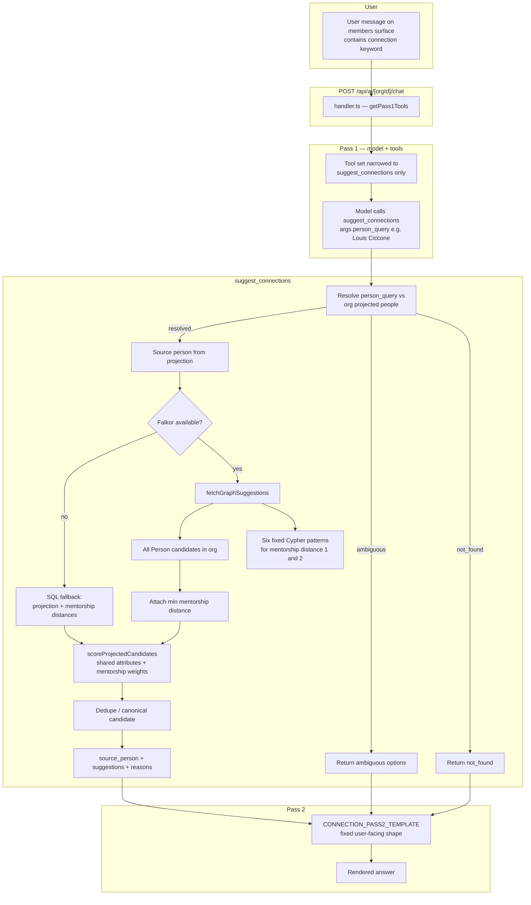

```mermaid
flowchart TD
  subgraph User
    U[User message on members surface\ncontains connection keyword]
  end

  subgraph Route["POST /api/ai/[orgId]/chat"]
    H[handler.ts — getPass1Tools]
  end

  subgraph Pass1["Pass 1 — model + tools"]
    T1[Tool set narrowed to\nsuggest_connections only]
    TC[Model calls suggest_connections\nargs.person_query e.g. Louis Ciccone]
  end

  subgraph Tool["suggest_connections"]
    R[Resolve person_query vs\norg projected people]
    R -->|resolved| SRC[Source person from projection]
    R -->|ambiguous| AMB[Return ambiguous options]
    R -->|not_found| NF[Return not_found]

    SRC --> BR{Falkor available?}
    BR -->|no| SQL[SQL fallback:\nprojection + mentorship distances]
    BR -->|yes| GK[fetchGraphSuggestions]
    GK --> ALL[All Person candidates in org]
    GK --> D12[Six fixed Cypher patterns\nfor mentorship distance 1 and 2]
    ALL --> MERGE[Attach min mentorship distance]
    SQL --> SCORE
    MERGE --> SCORE[scoreProjectedCandidates\nshared attributes + mentorship weights]
    SCORE --> DED[Dedupe / canonical candidate]
    DED --> OUT[source_person + suggestions + reasons]
  end

  subgraph Pass2["Pass 2"]
    T2[CONNECTION_PASS2_TEMPLATE\nfixed user-facing shape]
    T2 --> R2[Rendered answer]
  end

  U --> H
  H --> T1
  T1 --> TC
  TC --> R
  AMB --> T2
  NF --> T2
  OUT --> T2
```
