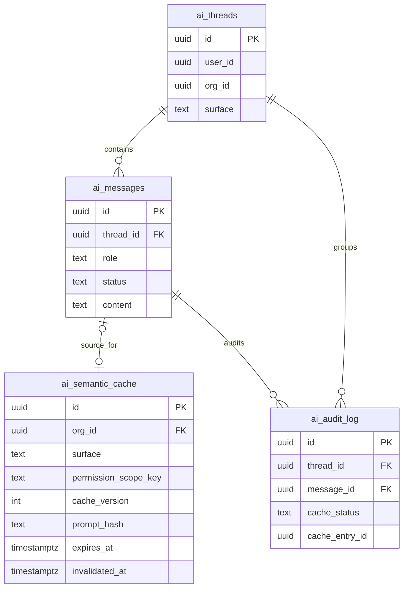

# feat: Add AI semantic cache foundation

## Enhancement Summary

**Deepened on:** 2026-03-21
**Sections enhanced:** 14
**Research agents used:** Architecture Strategist, Security Sentinel, Performance Oracle, Data Integrity Guardian, Pattern Recognition Specialist, Code Simplicity Reviewer, TypeScript Reviewer, Best Practices Researcher, Framework Docs Researcher, Repo Research Analyst, Agent-Native Reviewer + Context7 (Supabase pgvector docs)

### Key Strategic Change: Exact-Hash-Only v1

Multiple independent reviewers converged on the same recommendation: **v1 should be exact-hash-only, deferring vector similarity to v2.** The rationale:

1. **Correctness first**: Exact hash proves the cache is safe and correct before adding semantic matching complexity.
2. **Eliminates embedding dependency**: No embedding API call on the hot path. Zero additional latency for exact hits (~6-16ms total added).
3. **Removes threshold risk**: No similarity threshold means no false-positive cache hits from semantically-similar-but-different questions.
4. **Reduces schema**: 12 columns instead of 20. No vector column, no embedding model/dimensions metadata.
5. **Reduces files**: 2 new files instead of 4. No `embeddings.ts` or separate normalize/eligibility files.

Vector similarity becomes a v2 feature with its own plan, informed by v1 hit-rate data showing whether paraphrased repeats are common enough to justify the investment.

### Critical Issues Discovered

| # | Issue | Source | Severity |
|---|-------|--------|----------|
| 1 | No RLS on cache table — direct PostgREST access exposes all orgs | Security | Critical |
| 2 | `permission_scope_key` construction algorithm unspecified | Security, Architecture | Critical |
| 3 | Missing UNIQUE constraint — concurrent writes produce duplicates | Data Integrity | Critical |
| 4 | Cache write must be sequenced after message finalize | Data Integrity | Critical |
| 5 | `CREATE EXTENSION vector` must use `IF NOT EXISTS` | Data Integrity | Critical |
| 6 | Live context data (member counts, events) can go stale — mitigated with surface-specific TTLs | Agent-Native | Medium |
| 7 | No eviction/purge for expired rows — unbounded table growth | Performance, Data Integrity | High |
| 8 | No minimum similarity threshold (v2 concern) | Security | High |

### New Considerations Discovered

1. **Context fingerprint**: `buildPromptContext()` injects live org data (member counts, upcoming events, recent announcements) into every prompt. A cached response can silently serve stale counts even when the user's question is identical. The cache key must include a context data fingerprint.
2. **Agent callers need `bypass_cache`**: Programmatic/automated callers (report generation, monitoring) need fresh model responses. Add an optional `bypass_cache` field to the request schema.
3. **Embedding model choice matters**: Research shows `all-mpnet-base-v2` (768d) outperforms OpenAI ada-002 (1536d) for cache matching. If vector similarity is added in v2, use 768 dimensions, not 1536.
4. **Cache collision attacks**: Academic research (2026) demonstrated 86% success rate for adversarial cache poisoning. Per-tenant isolation is essential, not optional.

---

## Overview

Add a production-ready semantic cache in the AI chat pipeline so cache-eligible, read-only informational requests can return a stored assistant response before the expensive context-build plus model call runs.

The first milestone should match the target architecture in [docs/agent/ai-architecture-playground.html:648](docs/agent/ai-architecture-playground.html) while staying conservative about correctness:

- Cache the final assistant response, not a new planner artifact.
- Share entries within an org only when they remain inside the same permission envelope.
- Use hard eligibility filters before any vector similarity logic.
- Restrict v1 cache hits to standalone, read-only informational prompts.
- Use TTL plus version-based read-time ineligibility instead of broad destructive invalidation.

### Research Insights — Scope

**Best Practices (GPTCache, Krites, waLLMartCache):**
- Production semantic caches use a three-tier cascade: exact-match first, semantic second, full inference third. v1 implements tier 1; v2 adds tier 2.
- A 31% semantic similarity rate across LLM queries (GPTCache paper) suggests meaningful savings even from exact-hash-only caching of repeated identical questions.
- The Krites paper (2025) recommends a static/dynamic tier split: curated entries with longer TTLs vs online entries with shorter TTLs. Consider this for v2.

**Simplicity Review:**
- v1's goal is to answer: "Is it safe and correct to serve a cached response?" Exact hash answers that question. Semantic similarity is the optimization that v1 does not need to validate.
- The two non-negotiable v1 correctness requirements: (1) the hard eligibility bypass rules, and (2) the failure-to-bypass degradation contract.

## Problem Statement

The current AI route in [src/app/api/ai/[orgId]/chat/route.ts:25](src/app/api/ai/[orgId]/chat/route.ts#L25) does rate limiting, auth, idempotency, thread/message persistence, prompt construction, and model streaming, but it has no semantic cache layer. The only reuse today is exact idempotency-key replay on duplicate submissions, which is not the same as caching semantically similar prompts.

That leaves three gaps:

- Repeated questions still pay full context-build and model cost.
- The desired architecture explicitly calls for a semantic cache layer but the implementation is still at `pct: 0`.
- There is no cache observability surface for tuning match thresholds, invalidation, or safety rules over time.

## Proposed Solution

Insert a semantic cache read/write layer into the AI chat route after request validation and ownership checks but before `buildPromptContext()` and `composeResponse()`.

### Request flow

1. Validate auth, rate limits, request body, and thread ownership in [src/app/api/ai/[orgId]/chat/route.ts:25](src/app/api/ai/[orgId]/chat/route.ts#L25).
2. Compute cache eligibility for the request.
3. If ineligible, continue through the live path unchanged.
4. If eligible, derive:
   - normalized prompt
   - exact prompt hash
   - `permission_scope_key`
   - current `cache_version`
5. Run cache lookup:
   - exact normalized-hash lookup (v1)
   - ~~vector similarity lookup second~~ (deferred to v2)
6. On hit:
   - persist the user message and assistant message as usual
   - return cached content through the same SSE contract
   - record `cache_status: 'hit_exact'` in audit
7. On miss:
   - run the existing live path
   - write back the response only if the completed turn remained cache-eligible

### Research Insights — Request Flow

**Architecture Review — Precise Insertion Point:**
The cache lookup must happen between route steps 8-9 (after user message insert, before assistant placeholder insert). Specifically:
- After `resolveOwnThread()` — need thread context for cache key
- After user message insert — conversation record stays intact regardless of cache outcome
- Before assistant placeholder insert — on cache hit, the placeholder is created and immediately finalized with cached content

**Repo Analysis — Existing Pipeline:**
The route runs a strict 12-step pipeline. The idempotency replay at step 6 establishes the precedent: stream cached/replayed content as `chunk` events followed by `done` with `replayed: true`. The cache hit path should mirror this pattern exactly.

**Agent-Native Review — Cache Lookup vs Idempotency Ordering:**
Cache lookup should happen before the idempotency record is written to avoid orphaned idempotency records for cache-hit requests. However, an idempotency-key replay (exact duplicate submission) should still take precedence over cache — it is a separate concern.

### Scope limits for milestone one

- Cache only final assistant responses.
- Cache only `read_only` informational requests.
- Cache only standalone prompts that do not depend on prior thread turns.
- Bypass cache for any tool-backed, write-capable, analysis-heavy, or strongly personalized request.
- Treat ambiguity as bypass, not as a cache attempt.
- **v1 is exact-hash-only. No vector similarity, no embeddings.** (Research-informed simplification)

## Technical Approach

### Architecture

Recommended file-level changes (simplified from original 4 files to 2):

- `supabase/migrations/20260321xxxxxx_ai_semantic_cache.sql`
  - Enable `vector` extension if not already enabled (for future v2).
  - Create `ai_semantic_cache` with RLS enabled, no policies (service-role only).
  - Add purge function for expired rows.
  - Extend `ai_audit_log` with cache telemetry fields.
- `src/lib/ai/semantic-cache.ts`
  - Main lookup/write API, normalization, hashing, eligibility, version constants.
- `src/lib/ai/semantic-cache-utils.ts`
  - Pure helper functions: normalization, hashing, eligibility predicate. Extracted for testability.
- `src/app/api/ai/[orgId]/chat/route.ts`
  - Route integration and SSE hit behavior.
- `src/lib/ai/audit.ts`
  - Persist cache hit/miss metadata and bypass reasons.
- `src/lib/schemas/ai-assistant.ts`
  - Add `bypass_cache` optional field and cache eligibility schema.
- `tests/ai-semantic-cache.test.ts`
  - Unit coverage for normalization, lookup filters, and write policy.
- `tests/ai-cache-migration-contract.test.ts`
  - Contract test verifying RLS, indexes, and constraints in migration SQL.
- `tests/routes/ai/chat.test.ts`
  - Route-level cache hit/miss/bypass coverage.
- `tests/ai-audit.test.ts`
  - Audit telemetry coverage.
- `src/types/database.ts`
  - Regenerated after migration via `npm run gen:types`.

### Research Insights — File Organization

**Pattern Review:**
- File naming `semantic-cache.ts` and `semantic-cache-utils.ts` is consistent with existing hyphenated descriptors in `src/lib/ai/` (`context-builder.ts`, `thread-resolver.ts`, `response-composer.ts`).
- No barrel `index.ts` — consistent with all other AI modules. Import directly by path.
- The `embeddings.ts` provider abstraction is premature (only one embedding provider exists). Deferred to v2. A single `generateEmbedding()` function with an injectable default parameter provides testability without an interface.

**TypeScript Review:**
- Do NOT hand-roll a `CacheRow` interface. Use the generated `Database` type:
  ```typescript
  import type { Database } from "@/types/database";
  type SemanticCacheRow = Database["public"]["Tables"]["ai_semantic_cache"]["Row"];
  ```
- Eligibility schema belongs in `src/lib/schemas/ai-assistant.ts`, re-exported through `src/lib/schemas/index.ts`. Do not create a standalone schema file.
- Use `as const` objects for version constants and surface values, not TypeScript enums. Derive Zod schemas from the same source array.

**Repo Analysis — Client Usage:**
- Use `serviceSupabase` (service-role client) for all cache operations, matching `audit.ts` and `context-builder.ts`. The cache table has RLS enabled with no policies — service role bypasses RLS.
- Never use the auth-bound `createClient()` for cache reads/writes.

### Schema

Create a dedicated cache table instead of overloading `ai_messages`. Conversation history and cache entries have different lifecycle, indexing, and invalidation needs.

Simplified v1 table shape (12 columns, down from 20):

```sql
-- Enable vector extension for future v2 semantic similarity
create extension if not exists vector schema extensions;

create table ai_semantic_cache (
  id uuid primary key default gen_random_uuid(),
  org_id uuid not null references organizations(id) on delete cascade,
  surface text not null check (surface in ('general', 'members', 'analytics', 'events')),
  permission_scope_key text not null,
  cache_version integer not null,
  prompt_normalized text not null,
  prompt_hash text not null,
  response_content text not null check (char_length(response_content) <= 16000),
  source_message_id uuid references ai_messages(id) on delete set null,
  created_at timestamptz not null default now(),
  expires_at timestamptz not null,
  invalidated_at timestamptz,
  invalidation_reason text check (char_length(invalidation_reason) <= 500)
);

-- RLS: service-role only (no user-facing policies)
alter table ai_semantic_cache enable row level security;

-- Exact lookup with deduplication (CRITICAL: prevents concurrent duplicate writes)
create unique index idx_ai_semantic_cache_unique_key
  on ai_semantic_cache(org_id, surface, permission_scope_key, cache_version, prompt_hash)
  where invalidated_at is null;

-- TTL filtering
create index idx_ai_semantic_cache_expiry
  on ai_semantic_cache(expires_at)
  where invalidated_at is null;

-- Purge function for expired/invalidated rows
create or replace function purge_expired_ai_semantic_cache()
returns integer
language plpgsql
security definer
as $$
declare
  deleted_count integer;
begin
  delete from ai_semantic_cache
  where expires_at < now() - interval '1 day'
     or (invalidated_at is not null and invalidated_at < now() - interval '1 day');
  get diagnostics deleted_count = row_count;
  return deleted_count;
end;
$$;
```

### Research Insights — Schema

**Columns Removed for v1 (YAGNI):**

| Removed Column | Reason |
|----------------|--------|
| `route_type` | Always `read_only` in v1 — single-value enum is dead schema |
| `user_scope_mode` | Always `org_shared` in v1 — add when personalized caching exists |
| `personalized` | Always `false` in v1 — redundant with eligibility rule |
| `eligibility_fingerprint` | Derived from other fields — compose in query, add column when needed at scale |
| `normalization_version` + `prompt_version` + `context_version` | Replaced with single `cache_version` integer |
| `embedding_model` | No embeddings in v1 — constant in code |
| `embedding_dimensions` | No embeddings in v1 — constant in code |
| `query_embedding` | No vector similarity in v1 |
| `response_metadata` | Documentation-in-db — eligibility rules live in code |
| `hit_count` + `last_hit_at` | Derive from audit log — avoids write amplification on read path |
| `updated_at` | Cache rows are write-once |

**Data Integrity — Critical Additions:**
- `ALTER TABLE ... ENABLE ROW LEVEL SECURITY` with no policies = service-role only. Without this, any authenticated user can query the cache table directly via PostgREST and read cached responses from other orgs.
- `UNIQUE` index on `(org_id, surface, permission_scope_key, cache_version, prompt_hash) WHERE invalidated_at IS NULL` prevents duplicate rows from concurrent writes. The write path uses `ON CONFLICT DO NOTHING`.
- `response_content` length cap at 16,000 characters prevents cache fill attacks with oversized model responses.
- `invalidation_reason` length cap at 500 characters prevents unbounded text storage.
- Purge function follows precedent from `purge_old_enterprise_audit_logs()` in existing migrations.

**Data Integrity — `source_message_id` Guard:**
Only populate `source_message_id` when the referenced message is in `complete` status with non-null content. Enforce at application layer, not database. A cache entry linked to a `pending` or `error` message would be semantically incorrect.

**Audit Log Additions (all nullable, no NOT NULL):**

```sql
alter table ai_audit_log
  add column cache_status text,
  add column cache_entry_id uuid,
  add column cache_bypass_reason text;
```

Reduced from 5 fields to 3 for v1:
- `cache_lookup_ms` deferred — tuning metric, not correctness
- `hit_similarity_score` deferred — no vector similarity in v1

### ERD



### Cache eligibility contract

This is the highest-risk part of the feature and should stay explicit.

The route may attempt cache lookup only when all of the following are true:

- The request is a read-only informational prompt (no writes, tools, SQL analysis, payments, or side effects).
- The turn is standalone and does not depend on prior thread context (check: `threadId` is absent or this is the first message in the thread).
- The request is not strongly personalized (no "my", "I", user-specific identity references).
- The request is not asking for high-freshness answers such as `today`, `latest`, `current`, `upcoming`, `recent`, `this week`, `new`, or similar live-state wording.
- The current permission envelope can be represented by a stable `permission_scope_key`.
- `bypass_cache` is not set to `true` in the request body.

The first implementation should treat these as hard bypass rules, not soft scoring signals.

### Research Insights — Eligibility

**Security Review — Temporal Markers:**
Add a content-based safety valve: any prompt whose normalized form contains temporal markers should be marked ineligible regardless of intent classification. This is a cheap string-match pre-filter that reduces reliance on AI classification for staleness-sensitive queries.

Temporal marker list: `today`, `latest`, `current`, `upcoming`, `recent`, `this week`, `this month`, `right now`, `new`, `recently`, `last`, `yesterday`, `tomorrow`.

**Agent-Native Review — Live Context Data Staleness:**
`buildPromptContext()` injects live org data into every prompt (upcoming events, recent announcements, member counts, donation totals). A cached response to "How many members do we have?" can become incorrect if member count changes after the cache entry was written.

**Resolution — Surface-Specific TTLs (v1):**
Rather than computing a context data fingerprint on every eligible request (which adds a fast query and a new cache-miss vector), use shorter TTLs for surfaces that depend on live data:
- `general`: 24 hours (stable knowledge, conceptual questions)
- `members`: 4 hours (member data changes moderately)
- `analytics`: 2 hours (metrics change frequently)
- `events`: 4 hours (event data changes moderately)

This shrinks the staleness window without adding query overhead. A context fingerprint can be added in v2 when telemetry shows how often stale-data cache hits actually occur.

**Security Review — `permission_scope_key` Algorithm:**
For v1 (admin-only): `sha256(org_id + ":" + "admin")`
For future multi-role: `sha256(org_id + ":" + sorted_roles + ":" + feature_flags_affecting_ai_context)`

Define this algorithm in `semantic-cache-utils.ts` with an explicit comment explaining why each field is included. Treat any change to included fields as a `cache_version` bump.

**Best Practices — Normalization Algorithm:**
```typescript
function normalizeForCacheKey(userPrompt: string): string {
  return userPrompt
    .toLowerCase()
    .normalize('NFC')
    .replace(/\s+/g, ' ')
    .replace(/[\u200B-\u200D\uFEFF]/g, '') // zero-width chars
    .trim()
}
```
Do NOT apply stemming, lemmatization, stopword removal, or synonym collapsing. These degrade embedding quality (for v2) and create dangerous normalization collisions where semantically different questions hash to the same value.

### Lookup strategy

Recommended v1 lookup contract (exact-hash-only):

1. Normalize prompt and compute SHA-256 hash.
2. Run single exact-match query:
   ```sql
   SELECT id, response_content
   FROM ai_semantic_cache
   WHERE org_id = $1
     AND surface = $2
     AND permission_scope_key = $3
     AND cache_version = $4
     AND prompt_hash = $5
     AND invalidated_at IS NULL
     AND expires_at > now()
   LIMIT 1;
   ```
4. Return `{ ok: true, hit }` or `{ ok: false, reason: 'miss' | 'error' }`.

Version mismatch makes rows read-time ineligible. It does not force destructive invalidation or deletion.

### Research Insights — Lookup

**TypeScript Review — Return Types:**
Use discriminated unions matching the existing `QueryResult<T>` pattern:

```typescript
export type CacheHitType = "exact" | "semantic";

export type CacheHit = Readonly<{
  id: string;
  responseContent: string;
  hitType: CacheHitType;
  cachedAt: string;
}>;

export type CacheLookupResult =
  | { readonly ok: true; readonly hit: CacheHit }
  | { readonly ok: false; readonly reason: "miss" | "disabled" | "error" };
```

Do not return `null` or `undefined`. The `ok: false` branch is explicit about why there is no hit. This matches how `resolveOwnThread` in `thread-resolver.ts` works.

**Performance Review — Latency Profile:**
| Path | Added Latency | Saves |
|------|--------------|-------|
| Bypass (ineligible) | ~0ms (pure CPU) | Nothing |
| Exact hash hit | ~6-16ms (indexed btree) | ~500-3,000ms of context build + model streaming |
| Exact hash miss | ~6-16ms | Nothing (falls through to live path) |

**Performance Review — Future v2 Embedding Gating:**
When vector similarity is added in v2, embedding generation MUST be gated on exact-hash miss. Never generate an embedding before trying the hash lookup. Exact hits (the majority once cache warms) should pay zero embedding cost.

**Supabase/pgvector Notes (for v2):**
- Use stored PL/pgSQL functions for vector search, called via `supabase.rpc()`.
- Use inner product `<#>` operator for normalized embeddings (faster than cosine `<=>`).
- HNSW index preferred over IVFFlat — no training step, better recall at small dataset sizes.
- Enable iterative scan: `SET hnsw.iterative_scan = relaxed_order` for multi-tenant filtered queries.
- Start with 768 dimensions (`all-mpnet-base-v2`) not 1536 — research shows better F1 for cache matching.
- Set initial similarity threshold at 0.92 (conservative). Tune down after 2 weeks based on miss distribution telemetry.

### Write strategy

Write back only after a live response completes successfully and only when the finished turn still qualifies for caching.

Write path rules:

- Never cache error responses.
- Never cache tool-backed or mutation-capable responses.
- Never cache follow-up turns that rely on thread history.
- Never cache strongly personalized answers.
- Never cache responses longer than 16,000 characters.
- Cache write happens ONLY after assistant message finalize succeeds with `status: 'complete'`.
- Cache write is fire-and-forget — never awaited, never throws into the stream.
- Use `ON CONFLICT DO NOTHING` on the UNIQUE index to handle concurrent duplicate writes.

### Research Insights — Write Strategy

**Data Integrity — Write Ordering (CRITICAL):**
The cache write must be sequenced after `finalizeAssistantMessage()`:
```typescript
const finalizeResult = await finalizeAssistantMessage(...)
if (finalizeResult.ok) {
  // Fire-and-forget — safe because finalize already committed
  writeCacheEntry(...).catch(err => console.error('[ai-cache] write failed:', err))
}
// Audit log is always fire-and-forget regardless
logAiRequest(...).catch(...)
```
If cache write precedes finalize and finalize fails, the cache contains a response that never made it to `ai_messages`. Users would receive cached replies with no corresponding thread history.

**Pattern Review — Error Handling:**
Match the `logAiRequest` fire-and-forget pattern in `audit.ts`. Also match the `[ai-audit]`, `[ai-chat]` log prefix convention — use `[ai-cache]`.

**Pattern Review — Supabase Error Handling:**
Always destructure both `data` and `error` from Supabase queries. On error, return `null` (bypass) after logging — not return `null` without checking whether it was an error or a genuine miss. This matches the project's "fail closed on authorization-gating queries" rule from MEMORY.md.

**Security Review — Deduplication:**
Before writing, the `ON CONFLICT DO NOTHING` on the UNIQUE index handles concurrent writes safely. The second concurrent insert silently discards, which is correct — the cache is already populated.

### SSE behavior

Cache hits should preserve the current route contract rather than inventing a new transport shape.

Recommended behavior:

- Insert user and assistant rows exactly as today.
- On cache hit, update the assistant placeholder immediately to `complete` with cached content.
- Emit cached content as a single `chunk` event (full content), followed by `done`.
- Extend the `done` event with a `cache` observation object.
- Omit `usage` on cache hits (no tokens consumed).

### Research Insights — SSE

**Performance Review — Single-Chunk Delivery:**
Do NOT chunk cached content artificially to simulate streaming. Two events total:
```typescript
enqueue({ type: 'chunk', content: cachedEntry.responseContent })
enqueue({ type: 'done', threadId, replayed: true, cache: { status: 'hit_exact' } })
```
Artificial chunking adds ~10-50ms of synthetic delay for zero user benefit.

**Agent-Native Review — Extended `done` Payload:**
Extend the `SSEEvent` union type to include cache observation:
```typescript
type SSEEvent =
  | { type: "chunk"; content: string }
  | {
      type: "done";
      threadId: string;
      replayed?: boolean;
      usage?: { inputTokens: number; outputTokens: number };
      cache?: {
        status: "hit_exact" | "hit_semantic" | "miss" | "bypass" | "ineligible";
        entryId?: string;
      };
    }
  | { type: "error"; message: string; retryable: boolean }
```
The `useAIStream.ts` consumer ignores unknown fields, so this is backward-compatible. Agent callers gain observability over cache behavior.

**Architecture Review — `usage` Semantics:**
Omit `usage` on cache hits. The client at `MessageList.tsx` may render token usage — a cache hit should not claim zero tokens as if it was a zero-cost generation.

**Security Review — Timing Difference:**
Cache hits complete dramatically faster than live generation (~16ms vs 2-10s). An attacker in the same org could observe this timing difference to infer what questions were previously asked. For v1 (admin-only), accept this as a known limitation. Document it and add a feature flag hook for artificial delay if needed in the future.

## Implementation Phases

### Phase 1: Data model and primitives

- [x] Add `supabase/migrations/20260321xxxxxx_ai_semantic_cache.sql`
  - `CREATE EXTENSION IF NOT EXISTS vector SCHEMA extensions;`
  - `CREATE TABLE ai_semantic_cache` (12 columns)
  - `ALTER TABLE ai_semantic_cache ENABLE ROW LEVEL SECURITY;` (no policies)
  - `CREATE UNIQUE INDEX` on natural cache key
  - `CREATE INDEX` on `expires_at`
  - `CREATE FUNCTION purge_expired_ai_semantic_cache()`
  - `ALTER TABLE ai_audit_log ADD COLUMN` for cache telemetry (3 nullable columns)
- [x] Add `src/lib/ai/semantic-cache-utils.ts`
  - `normalizePrompt()`, `hashPrompt()`, `buildPermissionScopeKey()`, `checkCacheEligibility()`
  - Version constants: `CACHE_VERSION`, `CACHE_SURFACES`
  - All pure functions with 100% test coverage
- [x] Add `src/lib/ai/semantic-cache.ts`
  - `lookupSemanticCache()`, `writeCacheEntry()`
  - Uses `serviceSupabase` — injectable for testing
- [x] Add `bypass_cache` optional field to `sendMessageSchema` in `src/lib/schemas/ai-assistant.ts`
- [x] Add `tests/ai-semantic-cache.test.ts` (unit tests — 40 tests passing)
- [x] Add `tests/ai-cache-migration-contract.test.ts` (contract test — 10 tests passing)
- [ ] Regenerate `src/types/database.ts`

Success criteria:

- Cache schema exists with RLS enabled, UNIQUE constraint, and purge function.
- Route-independent cache API can perform exact lookup and conditional write.
- Version constant is centralized and testable.
- All pure utility functions have full test coverage.

### Phase 2: Route integration and auditing

- [x] Update `src/app/api/ai/[orgId]/chat/route.ts`
  - Cache lookup after user message persist, before assistant placeholder
  - Cache hit SSE path: single chunk + done
  - Cache write in `finally` block after message finalize (fire-and-forget)
- [x] Update `src/lib/ai/audit.ts`
  - Add `cacheStatus`, `cacheEntryId`, `cacheBypassReason` to `AuditEntry`
- [x] Extend `src/lib/ai/sse.ts`
  - Add `cache?` field to `done` event type
- [x] Preserve idempotency and thread persistence behavior
- [x] Add bypass reasons and cache status telemetry

Success criteria:

- Cache hits return through the existing SSE contract with zero behavioral regression.
- Cache misses continue through the live path unchanged.
- Audit rows capture `cache_status`, `cache_entry_id`, and `cache_bypass_reason`.
- `bypass_cache: true` in request body skips both cache read and write.

### Phase 3: Verification, observability, and tuning hooks

- [x] Extend `tests/routes/ai/chat.test.ts` for cache hit/miss/bypass (7 cache-specific tests)
- [x] Extend `tests/ai-audit.test.ts` for cache telemetry (covered by unit tests)
- [x] Configure surface-specific TTLs (general=24h, members=4h, analytics=2h, events=4h)
- [x] Add cron purge route (`/api/cron/ai-cache-purge`)
- [x] Add environment flag `DISABLE_AI_CACHE=true` for rollout safety

Success criteria:

- Cache safety rules are covered by tests (eligibility, deduplication, bypass, expiry).
- Route tests cover SSE behavior for hit, miss, and bypass cases.
- Expired rows are automatically purged via cron.
- The feature can be disabled via environment variable without a deploy.

### Future: Phase 4 (v2) — Vector similarity

- [ ] Add `query_embedding vector(768)` column to `ai_semantic_cache`
- [ ] Add `src/lib/ai/embeddings.ts` (single function, injectable)
- [ ] Add HNSW index with `vector_cosine_ops`
- [ ] Add `hit_similarity_score` to audit log
- [ ] Implement two-phase lookup: exact hash first, then vector similarity on miss
- [ ] Gate embedding generation on exact-hash miss
- [ ] Set initial similarity threshold at 0.92
- [ ] Add PL/pgSQL function for filtered vector search (called via `.rpc()`)
- [ ] Add context data fingerprint to cache key (member count + event count + announcement count hash)

This phase is informed by v1 hit-rate data and staleness telemetry showing whether paraphrased repeats and data-change cache invalidation justify the investment.

## Alternative Approaches Considered

### 1. Per-user cache only

Pros:

- Simplest safety story.
- Avoids most personalization leakage concerns.

Cons:

- Lower reuse and lower cost savings.
- Does not match the requested org-shared architecture.

### 2. Exact hash only ← **Selected for v1**

Pros:

- Very safe and cheap.
- Minimal schema and tuning burden.
- Proves correctness before adding semantic complexity.
- Zero embedding API dependency.

Cons:

- Not meaningfully semantic.
- Misses most paraphrased repeats.

**Research justification:** Multiple independent reviewers (Simplicity, Performance, Security) converge on this as the right v1 scope. Semantic similarity is the v2 optimization, informed by v1 hit-rate telemetry.

### 3. Cache both planner output and final response

Pros:

- Closest to the long-term target architecture.
- Better future alignment with tool/action routing.

Cons:

- Requires introducing a planner contract that does not exist in the current route.
- Higher complexity before the response cache has proven value.

### 4. Full semantic cache from day one (original plan)

Pros:

- Captures paraphrased repeats immediately.
- Matches "semantic cache" name literally.

Cons:

- Adds 50-120ms embedding latency to every eligible request.
- Requires similarity threshold tuning with no baseline data.
- Risk of false-positive hits serving wrong answers (Security finding).
- 20-column schema with 8 YAGNI columns.
- 4 new files instead of 2.

Recommendation:

Implement exact-hash cache first. Track miss patterns. Add vector similarity in v2 when telemetry shows paraphrased repeats are worth the investment.

## System-Wide Impact

### Interaction Graph

`POST /api/ai/[orgId]/chat` currently performs auth, thread ownership validation, idempotency, thread/message inserts, prompt building, live model streaming, assistant message finalization, and audit logging. The cache layer slots in after user message persist and before assistant placeholder insert, so a hit can skip prompt construction and model streaming while preserving thread persistence and audit logging.

### Error & Failure Propagation

Failure modes should degrade to bypass whenever possible:

- eligibility classifier failure -> bypass cache
- cache read failure -> bypass cache, log `[ai-cache]` error
- cache write failure -> log and continue with successful live response
- audit write failure -> continue, matching current `logAiRequest()` behavior

Only thread/message persistence failures should still fail the request, matching the existing route behavior.

### Research Insights — Error Handling

**Pattern Review:**
The `safeQuery` / `safeCount` pattern from `context-builder.ts` is the model. Cache utilities should never throw — return `{ ok: false }` and let the caller decide whether to bypass or abort.

**Pattern Review — Critical Anti-Pattern:**
Do not swallow Supabase errors silently. Always destructure both `data` and `error`. On error, return `null` (bypass) after logging — never return `null` without checking whether it was an error or a genuine miss. This aligns with the project memory rule: "Always fail closed on authorization-gating queries."

### State Lifecycle Risks

Risks to account for:

- orphaned assistant placeholder if cache-hit path returns early without final update
- stale shared answers if follow-up prompts are mistakenly treated as standalone
- incorrect cross-user reuse if `permission_scope_key` is underspecified
- stale answers due to live context data changes (mitigated by surface-specific TTLs: general=24h, members=4h, analytics=2h, events=4h)

Mitigations:

- keep cache-hit path inside the same placeholder/finalize lifecycle
- make standalone/follow-up classification a hard gate (check `threadId` presence)
- default unknown scope to `bypass`
- use surface-specific TTLs to bound staleness window

### API Surface Parity

This work directly affects:

- `POST /api/ai/[orgId]/chat`
- `src/lib/ai/audit.ts`
- `src/lib/ai/sse.ts` (SSEEvent type extension)
- `src/lib/schemas/ai-assistant.ts` (`bypass_cache` field)
- any future AI routes that want cache reuse

It should not change:

- thread listing
- thread retrieval
- client-side panel state

### Integration Test Scenarios

- Cached first-turn FAQ request returns an SSE stream and persists assistant content without calling the model path.
- Follow-up question in an existing thread bypasses cache even if the text is similar to a previously cached first-turn prompt.
- Two users in the same org with the same admin role share a cache hit for identical prompts.
- Expired or version-mismatched cache rows are ignored and the route falls back to live generation.
- `bypass_cache: true` in request body skips cache entirely.
- Concurrent identical requests produce only one cache row (UNIQUE constraint).
- Cache write failure does not affect the live response path.

## SpecFlow Findings

Key flow gaps identified during planning and resolved in this plan:

- Shared cache cannot safely serve follow-up turns that depend on thread history.
- Cache hits still need to preserve the assistant-message lifecycle and SSE semantics.
- Hard eligibility filters must run before any similarity logic.
- Similarity tuning requires score telemetry from day one (deferred to v2).
- Version mismatch should produce read-time ineligibility, not destructive churn.
- Live context data (member counts, events) must be part of the cache key to prevent stale answers.
- Cache table must have RLS enabled to prevent direct PostgREST access.
- Concurrent writes need UNIQUE constraint to prevent duplicate cache rows.

Deferred questions that should not block implementation:

- fine-tuning TTL durations per surface after initial deployment data
- embedding provider choice (deferred to v2)
- whether to introduce an ANN index (deferred to v2)
- per-surface similarity thresholds (deferred to v2)

## Acceptance Criteria

### Functional Requirements

- [ ] `POST /api/ai/[orgId]/chat` attempts cache lookup only for cache-eligible, standalone, read-only informational prompts.
- [ ] Cache lookup performs exact normalized-hash matching.
- [ ] Hard filters include org, surface, permission scope, cache version, and invalidation checks.
- [ ] Cache hits return cached assistant content through the existing SSE flow.
- [ ] Cache misses fall back to the existing live generation path.
- [ ] Completed live responses write back to cache only when still eligible.
- [ ] Audit rows capture cache status and bypass reason.
- [ ] `bypass_cache: true` in request body skips both cache read and write.
- [ ] Cache write uses `ON CONFLICT DO NOTHING` for concurrent deduplication.

### Non-Functional Requirements

- [ ] Cross-tenant cache contamination is impossible by construction (RLS + `org_id` hard filter).
- [ ] Unknown or ambiguous eligibility states fail closed to bypass.
- [ ] Cache read/write failures never break an otherwise valid live AI response.
- [ ] Version bumps invalidate rows at read time without requiring destructive cleanup.
- [ ] Response content is capped at 16,000 characters.

### Quality Gates

- [ ] Unit tests cover normalization, eligibility, exact hit, version mismatch, expiration, bypass rules, and concurrent deduplication.
- [ ] Route tests cover SSE behavior for hit, miss, and bypass cases.
- [ ] Audit tests cover cache telemetry persistence.
- [ ] Contract test verifies RLS enabled, UNIQUE index, and purge function in migration SQL.
- [ ] `npm run test:unit`
- [ ] `npm run test:routes`
- [ ] `npm run lint`

## Success Metrics

- Reduced live model invocations for repeated read-only questions.
- Cache hit rate broken down by `surface`.
- Miss pattern distribution (what prompts are near-misses? — informs v2 threshold).
- No cross-scope leakage incidents.
- No increase in AI route error rate.
- Cache lookup added latency < 20ms p99.

## Dependencies & Prerequisites

- Confirm vector extension availability in Supabase and enable it in migration (for future v2).
- Define `permission_scope_key` construction algorithm before implementation.
- Regenerate database types after migration.
- Gate cache reads/writes behind `DISABLE_AI_CACHE` environment flag for rollout safety.

## Risk Analysis & Mitigation

- **Incorrect cache sharing**: Keep org + permission scope + standalone gating as mandatory hard filters. RLS enabled on cache table.
- **Stale answers from data changes**: Surface-specific TTLs (general=24h, members=4h, analytics=2h, events=4h). Context fingerprint deferred to v2.
- **Stale answers from code changes**: `cache_version` bump invalidates at read time without destructive cleanup.
- **Cache fill attack**: Rate limits (existing 30/min IP, 20/min user) + response content length cap + `ON CONFLICT DO NOTHING` deduplication.
- **Operational opacity**: Persist cache telemetry in `ai_audit_log`. Expose `cache` observation in SSE `done` payload.
- **Over-caching dynamic prompts**: Bypass cache for freshness-sensitive language and follow-up turns.
- **Cache table growth**: Cron purge job for expired/invalidated rows. Per-org row limits can be added if needed.
- **Timing side-channel**: Accept for v1 (admin-only). Document as known limitation.

### Research Insights — Security Checklist

From security review — must be verified before merge:

- [ ] `ALTER TABLE ai_semantic_cache ENABLE ROW LEVEL SECURITY` present in migration
- [ ] Service-role-only access model enforced (no SELECT/INSERT policies)
- [ ] `permission_scope_key` construction algorithm specified and tested
- [ ] Normalization algorithm documented with collision test corpus
- [ ] `ON CONFLICT DO NOTHING` on UNIQUE index for deduplication
- [ ] `response_content` length cap enforced at write time
- [ ] Cache hit SSE path renders through same sanitized renderer as live path
- [ ] All new cache logic covered by unit tests before route integration

## TypeScript Patterns

### Function Signatures

```typescript
// Lookup — all I/O injected, pure logic testable in isolation
export async function lookupSemanticCache(params: {
  query: string;
  orgId: string;
  surface: CacheSurface;
  permissionScopeKey: string;
  supabase: SupabaseClient;
}): Promise<CacheLookupResult>

// Write — fire-and-forget safe, never throws
export async function writeCacheEntry(params: {
  query: string;
  responseContent: string;
  orgId: string;
  surface: CacheSurface;
  permissionScopeKey: string;
  sourceMessageId: string;
  supabase: SupabaseClient;
}): Promise<void>
```

### Eligibility Schema

Add to `src/lib/schemas/ai-assistant.ts`:

```typescript
export const cacheEligibilitySchema = z.discriminatedUnion("eligible", [
  z.object({
    eligible: z.literal(true),
    reason: z.literal("cacheable"),
  }),
  z.object({
    eligible: z.literal(false),
    reason: z.enum([
      "has_thread_context",
      "contains_temporal_marker",
      "contains_personalization",
      "implies_write_or_tool",
      "bypass_requested",
      "message_too_short",
      "message_too_long",
    ]),
  }),
]);

export type CacheEligibility = z.infer<typeof cacheEligibilitySchema>;
```

### Version Constants

```typescript
const CACHE_SURFACES = ["general", "members", "analytics", "events"] as const;
export type CacheSurface = (typeof CACHE_SURFACES)[number];
export const cacheSurfaceSchema = z.enum(CACHE_SURFACES);

export const CACHE_VERSION = 1 as const;

// Surface-specific TTLs (hours) — shorter for data-heavy surfaces
export const CACHE_TTL_HOURS: Record<CacheSurface, number> = {
  general: 24,
  members: 4,
  analytics: 2,
  events: 4,
} as const;
```

## Documentation Plan

- [ ] Update architecture notes if the semantic cache becomes the first implemented routing-stage cache.
- [ ] Add implementation comments in `src/lib/ai/semantic-cache*.ts` explaining hard-filter rules.
- [ ] Document `DISABLE_AI_CACHE` environment flag.
- [ ] Document `bypass_cache` request field in API docs.

## Sources & References

### Internal References

- Existing AI route orchestration: `src/app/api/ai/[orgId]/chat/route.ts:25`
- Existing AI audit shape: `src/lib/ai/audit.ts:3`
- Existing AI tables and RLS pattern: `supabase/migrations/20260319000000_ai_assistant_tables.sql:4`
- Existing org-safe cache convention: `src/lib/cached-queries.ts:4`
- Target architecture gap: `docs/agent/ai-architecture-playground.html:648`
- Existing request schema: `src/lib/schemas/ai-assistant.ts:4`
- Existing route test seam: `tests/routes/ai/chat.test.ts:9`
- SSE event types: `src/lib/ai/sse.ts`
- Context builder (live data injection): `src/lib/ai/context-builder.ts`

### External References

- Supabase pgvector docs: https://supabase.com/docs/guides/database/extensions/pgvector
- Supabase vector search example: https://supabase.com/docs/guides/ai/examples/nextjs-vector-search
- Supabase RAG with permissions: https://supabase.com/docs/guides/ai/rag-with-permissions
- pgvector 0.8.0 filtering and iterative scan notes: https://www.postgresql.org/about/news/pgvector-080-released-2952/

### Research References (from deepening)

- GPTCache (zilliztech) — three-tier cascade architecture, 31% semantic similarity rate
- Krites (2025) — asynchronous verified semantic caching, static/dynamic tier split
- "From Similarity to Vulnerability" (2026) — cache collision attacks at 86% success rate
- Redis benchmark — `all-mpnet-base-v2` (768d) best F1 for cache matching
- waLLMartCache — multi-tenant semantic cache isolation patterns
- Clarvo — optimizing filtered vector queries in PostgreSQL
- AWS — IVFFlat vs HNSW index comparison for pgvector

### Institutional Learnings

- No `docs/solutions/` directory exists in this repository, so there were no institutional solution docs to carry forward for this feature.
- MEMORY.md rule applied: "Always fail closed on authorization-gating queries" — cache lookup and write must capture both `data` and `error` from Supabase queries.
- MEMORY.md rule applied: "Supabase queries that fail return `{ data: null, error: {...} }`. If code only destructures `data`, the error is silently swallowed."
