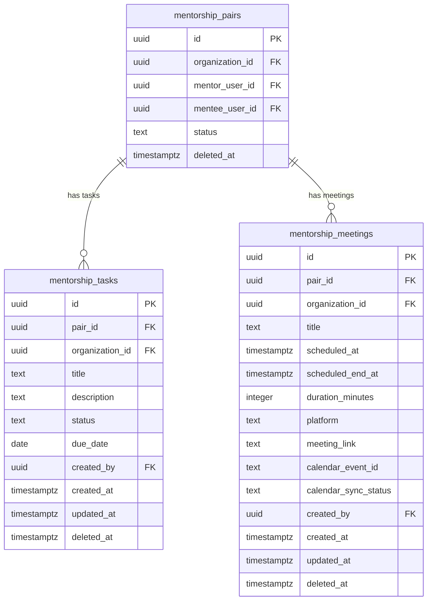

# feat: Mentorship PM Upgrade — Task Management & Meeting Scheduling

---

## Enhancement Summary

**Deepened on:** 2026-04-13
**Research agents used:** security-sentinel, architecture-strategist, performance-oracle, data-integrity-guardian, kieran-typescript-reviewer, julik-frontend-races-reviewer, best-practices-researcher, framework-docs-researcher, code-simplicity-reviewer, pattern-recognition-specialist

### Critical Security Fixes (act on before implementation)
1. **UPDATE policy missing `WITH CHECK`** — without it, mentees can bypass the API layer and write any field directly via the Supabase REST API. Both tasks and meetings UPDATE policies need `WITH CHECK (...)`.
2. **Cross-tenant IDOR on INSERT** — neither table's INSERT policy verifies that the caller-supplied `organization_id` matches the pair's actual org. An attacker in Org A could insert tasks/meetings linked to Org B's pairs. Fix: derive org_id from the pair row via a `BEFORE INSERT OR UPDATE` trigger.
3. **INSERT role bug** — `array['admin', 'alumni']` blocks `active_member` mentees from inserting tasks (they shouldn't be allowed, but the reason is wrong) AND the admin check requiring `mentor_user_id = auth.uid()` blocks admins who aren't mentors. Separate INSERT policies per role.

### Architecture Corrections
- `src/lib/google/mentorship-calendar.ts` → **`src/lib/mentorship/calendar.ts`** (domain logic belongs in domain dir)
- `src/lib/zoom/create-meeting.ts` → **`src/lib/zoom.ts`** (single-function file needs no directory)
- Remove `src/lib/mentorship/routes.ts` — one URL helper doesn't warrant a file; inline it
- Add `calendar_sync_status` column to meetings table to distinguish "link pending" from "intentionally no link"
- Convert Tasks/Meetings tabs to **client-side lazy fetching** — server-component conditional fetch causes a full server re-render on every tab switch

### Key Simplifications (from code-simplicity-reviewer)
- Merge `updateTaskSchema` + `updateTaskStatusOnlySchema` into one schema; discriminate inline in route handler
- Flat component directory: all files directly in `src/components/mentorship/` (no `tasks/` or `meetings/` subdirs)
- Fetch all tab data unconditionally in `page.tsx` for initial load (datasets are small per-pair; avoids tab-switch re-render)

---

## Overview

Upgrade the mentorship feature so mentors can act as product managers for their mentees: assign tasks with deadlines, track completion, and schedule Google Meet or Zoom meetings with automatic calendar invites. The mentorship page gains a tabbed layout (Overview | Tasks | Meetings | Directory) inspired by Linear/Notion, with URL-synced tab state and an optional pair-picker for users with multiple pairs.

## Problem Statement

The current mentorship feature is passive — it records session logs and links mentor/mentee pairs but gives mentors no tools to direct a mentee's growth. Mentors have no way to assign structured work, set deadlines, or schedule video meetings from within the app. This upgrade adds those tools while preserving all existing functionality.

## Proposed Solution

1. **Two new DB tables** (`mentorship_tasks`, `mentorship_meetings`) with RLS scoped to pair membership
2. **New API routes** for task CRUD and meeting creation (with Zoom/Google Meet integration)
3. **New components**: tab shell, pair picker, tasks tab, meetings tab, task form, schedule meeting form
4. **Page refactor**: `mentorship/page.tsx` adds `searchParams` and passes initial data to client tabs
5. **New lib utilities**: `src/lib/zoom.ts`, `src/lib/mentorship/calendar.ts`, `src/lib/mentorship/view-state.ts`

---

## Database Design



---

## Technical Approach

### Phase 1: Database Migrations

#### Migration 1 — `mentorship_tasks` table
File: `supabase/migrations/20261013000000_mentorship_tasks.sql`

```sql
create table public.mentorship_tasks (
  id              uuid primary key default gen_random_uuid(),
  pair_id         uuid not null references public.mentorship_pairs(id) on delete cascade,
  organization_id uuid not null references public.organizations(id) on delete cascade,
  title           text not null check (char_length(title) <= 255),
  description     text check (char_length(description) <= 2000),
  status          text not null default 'todo'
                    check (status in ('todo', 'in_progress', 'done')),
  due_date        date,
  created_by      uuid not null references auth.users(id) on delete cascade,
  created_at      timestamptz not null default now(),
  updated_at      timestamptz not null default now(),
  deleted_at      timestamptz
);

create index mentorship_tasks_pair_id_idx on public.mentorship_tasks(pair_id)
  where deleted_at is null;
create index mentorship_tasks_due_date_idx on public.mentorship_tasks(due_date)
  where deleted_at is null and status <> 'done';

alter table public.mentorship_tasks enable row level security;

-- SELECT: pair members only (admin check is implicit via pair membership in admin tooling)
create policy mentorship_tasks_select on public.mentorship_tasks
  for select using (
    deleted_at is null
    and (
      has_active_role(organization_id, array['admin'])
      or exists (
        select 1 from public.mentorship_pairs p
        where p.id = pair_id
          and p.deleted_at is null
          and (p.mentor_user_id = (select auth.uid()) or p.mentee_user_id = (select auth.uid()))
      )
    )
  );

-- INSERT: mentor of the pair only (separate policy for admins below)
create policy mentorship_tasks_insert_mentor on public.mentorship_tasks
  for insert with check (
    exists (
      select 1 from public.mentorship_pairs p
      where p.id = pair_id
        and p.deleted_at is null
        and p.mentor_user_id = (select auth.uid())
    )
  );

-- INSERT: admin can insert for any pair in their org
create policy mentorship_tasks_insert_admin on public.mentorship_tasks
  for insert with check (
    has_active_role(organization_id, array['admin'])
  );

-- UPDATE: pair members + admins can update rows they can see
-- Field-level mentee restriction (status-only) enforced at API layer.
-- WITH CHECK prevents the REST API from bypassing the API route.
create policy mentorship_tasks_update on public.mentorship_tasks
  for update
  using (
    deleted_at is null
    and (
      has_active_role(organization_id, array['admin'])
      or exists (
        select 1 from public.mentorship_pairs p
        where p.id = pair_id
          and p.deleted_at is null
          and (p.mentor_user_id = (select auth.uid()) or p.mentee_user_id = (select auth.uid()))
      )
    )
  )
  with check (
    -- immutable fields — prevent cross-pair moves via direct REST call
    pair_id = (select pair_id from public.mentorship_tasks t2 where t2.id = mentorship_tasks.id)
    and organization_id = (select organization_id from public.mentorship_tasks t2 where t2.id = mentorship_tasks.id)
  );
```

> **Note on org_id consistency:** The `BEFORE INSERT OR UPDATE` trigger in Migration 3 enforces that `organization_id` always matches the pair's actual `organization_id`. The INSERT policies do not trust caller-supplied `organization_id`.

#### Migration 2 — `mentorship_meetings` table
File: `supabase/migrations/20261013010000_mentorship_meetings.sql`

```sql
create table public.mentorship_meetings (
  id                   uuid primary key default gen_random_uuid(),
  pair_id              uuid not null references public.mentorship_pairs(id) on delete cascade,
  organization_id      uuid not null references public.organizations(id) on delete cascade,
  title                text not null check (char_length(title) <= 255),
  scheduled_at         timestamptz not null,
  duration_minutes     integer not null default 60
                         check (duration_minutes between 15 and 480),
  scheduled_end_at     timestamptz generated always as
                         (scheduled_at + (duration_minutes * interval '1 minute')) stored,
  platform             text not null check (platform in ('google_meet', 'zoom')),
  meeting_link         text check (meeting_link is null or char_length(meeting_link) <= 2048),
  calendar_event_id    text,
  calendar_sync_status text not null default 'none'
                         check (calendar_sync_status in ('none', 'pending', 'synced', 'failed')),
  created_by           uuid not null references auth.users(id) on delete cascade,
  created_at           timestamptz not null default now(),
  updated_at           timestamptz not null default now(),
  deleted_at           timestamptz
);

-- Index on scheduled_end_at for upcoming/past split (eliminates expression scan)
create index mentorship_meetings_pair_id_idx on public.mentorship_meetings(pair_id)
  where deleted_at is null;
create index mentorship_meetings_end_at_idx on public.mentorship_meetings(scheduled_end_at)
  where deleted_at is null;

alter table public.mentorship_meetings enable row level security;

-- SELECT: pair members + admins
create policy mentorship_meetings_select on public.mentorship_meetings
  for select using (
    deleted_at is null
    and (
      has_active_role(organization_id, array['admin'])
      or exists (
        select 1 from public.mentorship_pairs p
        where p.id = pair_id
          and p.deleted_at is null
          and (p.mentor_user_id = (select auth.uid()) or p.mentee_user_id = (select auth.uid()))
      )
    )
  );

-- INSERT: mentor of the pair only
create policy mentorship_meetings_insert_mentor on public.mentorship_meetings
  for insert with check (
    exists (
      select 1 from public.mentorship_pairs p
      where p.id = pair_id
        and p.deleted_at is null
        and p.mentor_user_id = (select auth.uid())
    )
  );

-- INSERT: admin
create policy mentorship_meetings_insert_admin on public.mentorship_meetings
  for insert with check (
    has_active_role(organization_id, array['admin'])
  );

-- UPDATE: mentor + admin only (soft-delete via UPDATE)
create policy mentorship_meetings_update on public.mentorship_meetings
  for update
  using (
    deleted_at is null
    and (
      has_active_role(organization_id, array['admin'])
      or exists (
        select 1 from public.mentorship_pairs p
        where p.id = pair_id
          and p.deleted_at is null
          and p.mentor_user_id = (select auth.uid())
      )
    )
  )
  with check (
    pair_id = (select pair_id from public.mentorship_meetings m2 where m2.id = mentorship_meetings.id)
    and organization_id = (select organization_id from public.mentorship_meetings m2 where m2.id = mentorship_meetings.id)
  );
```

#### Migration 3 — Cascade trigger + org_id consistency guard
File: `supabase/migrations/20261013020000_mentorship_pair_deletion_cascade.sql`

```sql
-- 1. Enforce organization_id consistency on tasks and meetings.
--    The caller-supplied organization_id must match the pair's org — prevents cross-tenant inserts.
create or replace function public.enforce_mentorship_org_consistency()
returns trigger language plpgsql security definer
set search_path = ''
as $$
declare
  v_pair_org_id uuid;
begin
  select organization_id into v_pair_org_id
  from public.mentorship_pairs
  where id = new.pair_id;

  if v_pair_org_id is null then
    raise exception 'mentorship pair not found or deleted';
  end if;

  -- Always derive org_id from the pair row, ignoring whatever the caller supplied
  new.organization_id := v_pair_org_id;
  return new;
end;
$$;

create trigger mentorship_tasks_org_consistency
  before insert or update on public.mentorship_tasks
  for each row execute function public.enforce_mentorship_org_consistency();

create trigger mentorship_meetings_org_consistency
  before insert or update on public.mentorship_meetings
  for each row execute function public.enforce_mentorship_org_consistency();

-- 2. When a mentorship pair is soft-deleted, cascade to tasks and meetings.
--    Use "OF deleted_at" so the trigger only fires when that specific column changes.
create or replace function public.cascade_mentorship_pair_soft_delete()
returns trigger language plpgsql security definer
set search_path = ''
as $$
begin
  if new.deleted_at is not null and old.deleted_at is null then
    update public.mentorship_tasks
    set deleted_at = new.deleted_at, updated_at = now()
    where pair_id = new.id and deleted_at is null;

    update public.mentorship_meetings
    set deleted_at = new.deleted_at, updated_at = now()
    where pair_id = new.id and deleted_at is null;
  end if;
  return new;
end;
$$;

create trigger mentorship_pair_soft_delete_cascade
  after update of deleted_at on public.mentorship_pairs
  for each row execute function public.cascade_mentorship_pair_soft_delete();
```

Apply all three migrations via `/apply-migration`.

---

### Phase 2: Lib Layer

#### 2a. View-state helpers
`src/lib/mentorship/view-state.ts`:
```typescript
export type MentorshipTab = 'overview' | 'tasks' | 'meetings' | 'directory';

const VALID_TABS = ['overview', 'tasks', 'meetings', 'directory'] as const;

// Type guard — avoids unsafe `as` cast
function isMentorshipTab(raw: string): raw is MentorshipTab {
  return (VALID_TABS as readonly string[]).includes(raw);
}

export function parseMentorshipTab(raw: string | undefined): MentorshipTab {
  if (!raw || !isMentorshipTab(raw)) return 'overview';
  return raw;
}
```

No `routes.ts` file — the single URL helper is one line; inline it at the call site:
```typescript
// Inline where needed:
`/${orgSlug}/mentorship?tab=${tab}${pairId ? `&pair=${pairId}` : ''}`
```

#### 2b. Extend `src/lib/mentorship/schemas.ts`

Add to the existing file:
```typescript
export const createTaskSchema = z.object({
  pair_id: z.string().uuid(),
  title: z.string().min(1).max(255),
  description: z.string().max(2000).optional(),
  due_date: z.string().regex(/^\d{4}-\d{2}-\d{2}$/).optional().nullable(),
  status: z.enum(['todo', 'in_progress', 'done']).default('todo'),
});

// Single update schema — the route handler enforces field-level restrictions
export const updateTaskSchema = z.object({
  title: z.string().min(1).max(255).optional(),
  description: z.string().max(2000).optional().nullable(),
  due_date: z.string().regex(/^\d{4}-\d{2}-\d{2}$/).optional().nullable(),
  status: z.enum(['todo', 'in_progress', 'done']).optional(),
});

export const createMeetingSchema = z.object({
  pair_id: z.string().uuid(),
  title: z.string().min(1).max(255),
  scheduled_at: z.string().datetime({ offset: true }),
  duration_minutes: z.number().int().min(15).max(480).default(60),
  platform: z.enum(['google_meet', 'zoom']),
});
```

> **Note:** A single `updateTaskSchema` replaces the original two-schema approach. The PATCH handler checks caller role inline and rejects non-status keys for mentees — no separate schema needed.

#### 2c. New `src/lib/zoom.ts`

Server-to-server OAuth2 meeting creation with module-level token cache (tokens valid 1 hour; fetch-on-demand wastes ~200ms per meeting creation):

```typescript
// src/lib/zoom.ts
const ZOOM_TOKEN_URL = 'https://zoom.us/oauth/token';
const ZOOM_API_BASE = 'https://api.zoom.us/v2';

// Module-level token cache — shared across Lambda warm instances
let cachedToken: { token: string; expiresAt: number } | null = null;

export type ZoomMeetingResult =
  | { ok: true; meetingId: number; joinUrl: string; password: string }
  | { ok: false; error: string };

async function getZoomAccessToken(): Promise<string> {
  // Return cached token if still valid (with 5-min buffer)
  if (cachedToken && Date.now() < cachedToken.expiresAt) {
    return cachedToken.token;
  }

  const { ZOOM_ACCOUNT_ID, ZOOM_CLIENT_ID, ZOOM_CLIENT_SECRET } = process.env;
  if (!ZOOM_ACCOUNT_ID || !ZOOM_CLIENT_ID || !ZOOM_CLIENT_SECRET) {
    throw new Error('Zoom credentials not configured');
  }

  const credentials = Buffer.from(`${ZOOM_CLIENT_ID}:${ZOOM_CLIENT_SECRET}`).toString('base64');
  const res = await fetch(
    `${ZOOM_TOKEN_URL}?grant_type=account_credentials&account_id=${ZOOM_ACCOUNT_ID}`,
    {
      method: 'POST',
      headers: {
        Authorization: `Basic ${credentials}`,
        'Content-Type': 'application/x-www-form-urlencoded',
      },
    }
  );
  if (!res.ok) throw new Error(`Zoom token error: ${res.status}`);

  const data = await res.json();
  // Runtime guard — never trust external API response shape
  if (typeof data.access_token !== 'string' || typeof data.expires_in !== 'number') {
    throw new Error('Unexpected Zoom token response shape');
  }

  cachedToken = {
    token: data.access_token,
    expiresAt: Date.now() + (data.expires_in - 300) * 1000, // 5-min buffer
  };
  return cachedToken.token;
}

export async function createZoomMeeting(params: {
  title: string;
  startAt: string;       // ISO 8601 with offset
  durationMinutes: number;
  timezone: string;      // IANA timezone, e.g. "America/New_York"
}): Promise<ZoomMeetingResult> {
  try {
    const accessToken = await getZoomAccessToken();
    const res = await fetch(`${ZOOM_API_BASE}/users/me/meetings`, {
      method: 'POST',
      headers: {
        Authorization: `Bearer ${accessToken}`,
        'Content-Type': 'application/json',
      },
      body: JSON.stringify({
        topic: params.title,
        type: 2,                          // Scheduled one-time meeting
        start_time: params.startAt,
        duration: params.durationMinutes,
        timezone: params.timezone,
        settings: { join_before_host: true },
      }),
    });

    if (!res.ok) {
      const err = await res.json().catch(() => ({}));
      // Do NOT log the full error object — it may contain auth context
      return { ok: false, error: `Zoom meeting creation failed (${res.status})` };
    }

    const meeting = await res.json();
    // Runtime guards — never cast external API fields
    if (typeof meeting.id !== 'number' || typeof meeting.join_url !== 'string') {
      return { ok: false, error: 'Unexpected Zoom meeting response shape' };
    }
    // Do NOT store start_url — it contains an ephemeral ZAK token
    return {
      ok: true,
      meetingId: meeting.id,
      joinUrl: meeting.join_url,
      password: typeof meeting.password === 'string' ? meeting.password : '',
    };
  } catch (err) {
    const msg = err instanceof Error ? err.message : 'Unknown Zoom error';
    return { ok: false, error: msg };
  }
}
```

> **FERPA / security note:** `join_url` contains meeting credentials and should be treated as sensitive. When writing to `mentorship_meetings.meeting_link`, encrypt with `encryptToken` / `decryptToken` from `src/lib/google/token-encryption.ts` (same pattern used for Google OAuth tokens). Decrypt only when serving the join link to authenticated pair members.

Add to `next.config.mjs` (follow the warn-on-partial-config pattern used by `microsoftCalendarEnv`):
```js
const zoomEnv = ['ZOOM_ACCOUNT_ID', 'ZOOM_CLIENT_ID', 'ZOOM_CLIENT_SECRET'];
// warn-only, same as Google/Microsoft calendar optional vars
```

#### 2d. New `src/lib/mentorship/calendar.ts`

**Location change from original plan**: domain logic belongs in `src/lib/mentorship/`, not `src/lib/google/`. Do NOT modify `calendar-sync.ts`.

```typescript
// src/lib/mentorship/calendar.ts
import { google } from 'googleapis';
import { randomUUID } from 'crypto';

export type MentorshipCalendarResult =
  | { ok: true; googleEventId: string; meetLink?: string }
  | { ok: false; error: string };

export async function createMentorshipMeetingCalendarEvent(
  accessToken: string,
  params: {
    title: string;
    startAt: string;           // ISO 8601 with offset
    durationMinutes: number;
    timeZone: string;          // IANA timezone
    mentorEmail: string;
    menteeEmail: string;
    platform: 'google_meet' | 'zoom';
    zoomJoinUrl?: string;
    zoomPassword?: string;
  }
): Promise<MentorshipCalendarResult> {
  const auth = new google.auth.OAuth2();
  auth.setCredentials({ access_token: accessToken });
  const calendar = google.calendar({ version: 'v3', auth });

  const startDate = new Date(params.startAt);
  const endDate = new Date(startDate.getTime() + params.durationMinutes * 60_000);

  const requestBody: Record<string, unknown> = {
    summary: params.title,
    start: { dateTime: startDate.toISOString(), timeZone: params.timeZone },
    end: { dateTime: endDate.toISOString(), timeZone: params.timeZone },
    attendees: [{ email: params.mentorEmail }, { email: params.menteeEmail }],
    guestsCanModify: false,
    reminders: { useDefault: true },
  };

  if (params.platform === 'google_meet') {
    requestBody.conferenceData = {
      createRequest: {
        requestId: randomUUID(),
        conferenceSolutionKey: { type: 'hangoutsMeet' },
      },
    };
  } else {
    requestBody.location = params.zoomJoinUrl;
    requestBody.description =
      `Platform: Zoom\nJoin URL: ${params.zoomJoinUrl}` +
      (params.zoomPassword ? `\nPassword: ${params.zoomPassword}` : '');
  }

  try {
    const response = await calendar.events.insert({
      calendarId: 'primary',
      // conferenceDataVersion MUST be a query param — silently ignored if put in body
      conferenceDataVersion: params.platform === 'google_meet' ? 1 : 0,
      sendUpdates: 'all',     // sends email invites to attendees
      requestBody,
    });

    const event = response.data;

    // conferenceData creation is async — check for "pending" status and retry up to 3x
    let meetLink = event.conferenceData?.entryPoints?.find(
      (e) => e.entryPointType === 'video'
    )?.uri;

    if (
      params.platform === 'google_meet' &&
      event.conferenceData?.createRequest?.status?.statusCode === 'pending' &&
      !meetLink
    ) {
      for (let attempt = 0; attempt < 3 && !meetLink; attempt++) {
        await new Promise((r) => setTimeout(r, 1000));
        const retry = await calendar.events.get({
          calendarId: 'primary',
          eventId: event.id!,
        });
        meetLink = retry.data.conferenceData?.entryPoints?.find(
          (e) => e.entryPointType === 'video'
        )?.uri;
      }
    }

    return { ok: true, googleEventId: event.id ?? '', meetLink };
  } catch (err: unknown) {
    // Sanitize error before logging — GaxiosError includes request headers with auth token
    const msg = err instanceof Error ? err.message : 'Unknown Google Calendar error';
    return { ok: false, error: msg };
  }
}

export async function deleteMentorshipMeetingCalendarEvent(
  accessToken: string,
  calendarEventId: string
): Promise<void> {
  const auth = new google.auth.OAuth2();
  auth.setCredentials({ access_token: accessToken });
  const calendar = google.calendar({ version: 'v3', auth });
  try {
    await calendar.events.delete({
      calendarId: 'primary',
      eventId: calendarEventId,
      sendUpdates: 'all',
    });
  } catch {
    // Best-effort: if deletion fails (event already removed, token expired), log and continue
  }
}
```

---

### Phase 3: API Routes

All routes follow the canonical boilerplate from `src/app/api/organizations/[organizationId]/alumni/route.ts`:
- `export const dynamic = "force-dynamic"; export const runtime = "nodejs";`
- UUID validation via `baseSchemas.uuid`
- Auth via `createClient()` + `supabase.auth.getUser()`
- Role check via `getOrgContext()` from `src/lib/auth/roles.ts`
- Rate limit via `checkRateLimit` / `buildRateLimitResponse`
- Body validation via `validateJson` / `ValidationError`
- Writes via `createServiceClient()`

#### Tasks routes

**`src/app/api/organizations/[organizationId]/mentorship/tasks/route.ts`**

- `GET ?pairId=uuid` — verify caller is pair member or admin; return tasks ordered by `due_date asc nulls last, created_at asc`
- `POST` body: `createTaskSchema` — verify `pair_id` exists and is not deleted; verify caller is `mentor_user_id` of that pair (or admin); insert (org_id overwritten by trigger from pair's org)

**`src/app/api/organizations/[organizationId]/mentorship/tasks/[taskId]/route.ts`**

- `PATCH` — role fork:
  - Mentor (alumni) or admin: validate `updateTaskSchema`, apply full update
  - Mentee (active_member): if body contains any key besides `status`, return 403 "Mentees may only update task status"; otherwise validate `{ status }` and apply
  - Anyone else: 403
- `DELETE` — soft-delete (`updated_at = now(), deleted_at = now()`); mentor + admin only

#### Meetings routes

**`src/app/api/organizations/[organizationId]/mentorship/meetings/route.ts`**

- `GET ?pairId=uuid` — verify caller is pair member or admin; split on `scheduled_end_at > now()` (uses generated column — no expression scan); return `{ upcoming: Meeting[], past: Meeting[] }`
- `POST` body: `createMeetingSchema` — complex route:
  1. Validate schema; verify caller is `mentor_user_id` of the pair (or admin)
  2. Fetch mentor + mentee `email` from `auth.users`; fetch org `timezone` from `organizations`
  3. If `platform === 'zoom'`: call `createZoomMeeting()` → `ZoomMeetingResult`; if `!ok` return 503
  4. Call `getValidAccessToken(supabase, user.id)` → `null | string`
  5. If access token available: call `createMentorshipMeetingCalendarEvent()` → `MentorshipCalendarResult`
  6. Determine `meeting_link` and `calendar_sync_status`:
     - Google Meet: `meetLink` from step 5 if `ok`, else `null`; status = `meetLink ? 'synced' : 'failed'`
     - Zoom: `joinUrl` from step 3 (independent of calendar success); encrypt with `encryptToken`; status = calendar ok ? `'synced'` : access token absent ? `'none'` : `'failed'`
  7. Insert into `mentorship_meetings` via `createServiceClient()`
  8. Return `{ meeting, calendarInviteSent: boolean, calendarError?: string }`

**`src/app/api/organizations/[organizationId]/mentorship/meetings/[meetingId]/route.ts`**

- `DELETE` — soft-delete meeting; if `calendar_event_id` is set and access token available, call `deleteMentorshipMeetingCalendarEvent()` best-effort (non-blocking); return 200 regardless of calendar result

---

### Phase 4: Frontend Components

All components go directly in `src/components/mentorship/` — **no `tasks/` or `meetings/` subdirectories** (matches existing project flat pattern).

#### 4a. `src/components/mentorship/MentorshipTabShell.tsx` — `"use client"`

Reads `?tab=` from `useSearchParams()`. Must be wrapped in `<Suspense>` at the page level.

```typescript
interface MentorshipTabShellProps {
  initialTab: MentorshipTab;
  orgSlug: string;
  overview: React.ReactNode;
  tasks: React.ReactNode;
  meetings: React.ReactNode;
  directory: React.ReactNode;
}
```

- Tab bar styled consistently with the calendar tab pattern
- On tab click: `router.replace(`/${orgSlug}/mentorship?tab=${newTab}`, { scroll: false })`
- Use local `activeTab` state initialized from `initialTab` for instant visual response; the URL replace runs asynchronously

#### 4b. `src/components/mentorship/MentorshipPairPicker.tsx` — `"use client"`

```typescript
interface MentorshipPairPickerProps {
  pairs: Array<{ id: string; mentorName: string; menteeName: string }>;
  selectedPairId: string;
  onPairChange: (pairId: string) => void;
}
```

Renders only when `pairs.length > 1`. Options labeled "MentorName → MenteeName".

#### 4c. `src/components/mentorship/MentorshipTasksTab.tsx` — `"use client"`

```typescript
interface MentorshipTasksTabProps {
  initialTasks: MentorshipTask[];
  pairs: Array<{ id: string; mentorName: string; menteeName: string }>;
  initialPairId: string;
  isMentor: boolean;    // true for alumni or admin
  isAdmin: boolean;
  orgId: string;
  orgSlug: string;
  currentUserId: string;
}
```

**Race condition handling:**
- Pair picker changes: cancel the in-flight fetch for the previous pair using `AbortController` before starting a new one
- Status badge clicks: track `patchingIds: Set<string>` to disable double-taps while a status PATCH is in flight
- Optimistic task status updates: use `useOptimistic` + `startTransition` for immediate visual feedback with auto-revert on failure

```typescript
// Pattern for optimistic status update
const [optimisticTasks, updateOptimistic] = useOptimistic(tasks);

function handleStatusCycle(taskId: string, currentStatus: string) {
  const next = nextStatus(currentStatus);
  startTransition(async () => {
    updateOptimistic((prev) =>
      prev.map((t) => (t.id === taskId ? { ...t, status: next } : t))
    );
    const res = await fetch(`/api/.../tasks/${taskId}`, {
      method: 'PATCH',
      body: JSON.stringify({ status: next }),
    });
    if (!res.ok) {
      showFeedback('error', 'Failed to update task status');
      // useOptimistic auto-reverts on thrown error if you use throw
    }
  });
}
```

**Pair change with AbortController:**
```typescript
const abortRef = useRef<AbortController | null>(null);

async function loadTasksForPair(pairId: string) {
  abortRef.current?.abort();
  abortRef.current = new AbortController();
  try {
    const res = await fetch(`/api/.../tasks?pairId=${pairId}`, {
      signal: abortRef.current.signal,
    });
    const data = await res.json();
    setTasks(data);
  } catch (err) {
    if (err instanceof Error && err.name === 'AbortError') return; // stale fetch, ignore
    showFeedback('error', 'Failed to load tasks');
  }
}
```

**Table layout**: Title | Status badge | Due Date | Actions
- Status badge: `todo` → `muted`, `in_progress` → `primary`, `done` → `success`
- Overdue row: `due_date < today (local date) && status !== 'done'` → `bg-red-50 dark:bg-red-950`
- Status filter: local state only (no URL), `<Select>` above table
- Mentor: "Add Task" → expands `<MentorshipTaskForm>` inline at table bottom
- Empty state: appropriate message when no pair or no tasks

#### 4d. `src/components/mentorship/MentorshipTaskForm.tsx` — `"use client"`

Inline expandable form (not modal):
- Fields: title (required), description (textarea, optional), due_date (date input, optional)
- `POST .../tasks`; on success: prepend task to list optimistically; collapse form
- `onCancel`: collapse without submission

**Toasts**: Use `showFeedback` from `@/lib/feedback/show-feedback` (NOT `toast()` or `useToast()`).

#### 4e. `src/components/mentorship/MentorshipMeetingsTab.tsx` — `"use client"`

```typescript
interface MentorshipMeetingsTabProps {
  initialUpcoming: MentorshipMeeting[];
  initialPast: MentorshipMeeting[];
  pairs: Array<{ id: string; mentorName: string; menteeName: string }>;
  initialPairId: string;
  isMentor: boolean;
  isAdmin: boolean;
  orgId: string;
  orgSlug: string;
  currentUserId: string;
}
```

- Same `AbortController` pattern as tasks tab for pair switching
- **Upcoming section**: meeting cards — title, formatted date/time, duration, platform badge (`primary` for Meet, `muted` for Zoom), "Join Meeting" button linking to `meeting_link`
  - `meeting_link === null` + `calendar_sync_status === 'failed'`: "Link unavailable — calendar invite failed" badge
  - `meeting_link === null` + `calendar_sync_status === 'none'`: "No calendar connected" badge
- **Past section**: compact log list below a divider (use `scheduled_end_at < now()` to classify)
- "Schedule Meeting" button: mentor only; shows `<MentorshipScheduleMeetingForm>`

**Toasts**: use `showFeedback` from `@/lib/feedback/show-feedback`.

#### 4f. `src/components/mentorship/MentorshipScheduleMeetingForm.tsx` — `"use client"`

Form fields:
- Title (text, required)
- Date (date input)
- Time (time input, combined to ISO datetime on submit)
- Duration (`<Select>`: 30 / 45 / 60 / 90 min)
- Platform (radio: "Google Meet" / "Zoom")

Named submit states prevent vague "loading" UX:
```typescript
type SubmitState = 'idle' | 'creating_zoom' | 'creating_calendar' | 'saving' | 'done' | 'error';
```

On submit:
1. `platform === 'zoom'` → show "Creating Zoom meeting…"
2. Calendar step → show "Creating calendar invite…"
3. Saving → show "Saving…"
4. **Success** (`calendarInviteSent: true`): `showFeedback('success', 'Meeting scheduled — calendar invites sent')`
5. **Partial success** (`calendarInviteSent: false`, meeting saved): `showFeedback('warning', 'Meeting saved — calendar invite could not be sent. Share the link manually.')`
6. **Error**: `showFeedback('error', message)`

---

### Phase 5: Page Refactor

**`src/app/[orgSlug]/mentorship/page.tsx`** — modified

```typescript
interface MentorshipPageProps {
  params: Promise<{ orgSlug: string }>;
  searchParams: Promise<{ tab?: string; pair?: string }>;
}

export default async function MentorshipPage({ params, searchParams }: MentorshipPageProps) {
  const { orgSlug } = await params;
  const { tab: rawTab, pair: rawPair } = await searchParams;
  const activeTab = parseMentorshipTab(rawTab);

  // Validate pair param — must be a valid UUID
  const pairIdParam = baseSchemas.uuid.safeParse(rawPair).success ? rawPair : undefined;

  // ... existing auth + org context fetch (always runs) ...
  // ... existing pairs + mentor profiles fetch (always runs for Overview) ...

  const visiblePairIds = filteredPairs.map((p) => p.id);
  const initialPairId = visiblePairIds.includes(pairIdParam ?? '')
    ? pairIdParam!
    : visiblePairIds[0] ?? null;

  // Fetch all tab data unconditionally — datasets are small per-pair
  // Avoids full server re-render on tab switch; client components refetch on pair change
  let initialTasks: MentorshipTask[] = [];
  let initialUpcoming: MentorshipMeeting[] = [];
  let initialPast: MentorshipMeeting[] = [];

  if (initialPairId) {
    // Parallel fetch
    [initialTasks, { upcoming: initialUpcoming, past: initialPast }] = await Promise.all([
      fetchTasksForPair(initialPairId, supabase),
      fetchMeetingsForPair(initialPairId, supabase),
    ]);
  }

  return (
    <Suspense fallback={<MentorshipPageSkeleton />}>
      <MentorshipTabShell
        initialTab={activeTab}
        orgSlug={orgSlug}
        overview={<existing overview content />}
        tasks={
          <MentorshipTasksTab
            initialTasks={initialTasks}
            pairs={pairsForPicker}
            initialPairId={initialPairId ?? ''}
            isMentor={role === 'alumni' || isAdmin}
            isAdmin={isAdmin}
            orgId={org.id}
            orgSlug={orgSlug}
            currentUserId={userId}
          />
        }
        meetings={
          <MentorshipMeetingsTab
            initialUpcoming={initialUpcoming}
            initialPast={initialPast}
            pairs={pairsForPicker}
            initialPairId={initialPairId ?? ''}
            isMentor={role === 'alumni' || isAdmin}
            isAdmin={isAdmin}
            orgId={org.id}
            orgSlug={orgSlug}
            currentUserId={userId}
          />
        }
        directory={<MentorDirectory ... />}
      />
    </Suspense>
  );
}
```

> **Why unconditional fetch:** Per-tab conditional fetching (original plan) triggers a full server component re-render on every tab click, adding ~200–400ms and a loading flash. Fetching all data unconditionally is safe because pair-scoped datasets are small (typically <20 tasks, <10 meetings per pair). Client tabs refetch independently when the pair picker changes.

---

### Implementation Order

```
Step 1   supabase/migrations/20261013000000_mentorship_tasks.sql
Step 2   supabase/migrations/20261013010000_mentorship_meetings.sql
Step 3   supabase/migrations/20261013020000_mentorship_pair_deletion_cascade.sql  (depends 1+2)
Step 4   src/lib/mentorship/schemas.ts — add task + meeting schemas
Step 5   src/lib/zoom.ts
Step 6   src/lib/mentorship/calendar.ts
Step 7   src/lib/mentorship/view-state.ts
Step 8   API: mentorship/tasks/route.ts                  (depends 1, 4)
Step 9   API: mentorship/tasks/[taskId]/route.ts         (depends 8)
Step 10  API: mentorship/meetings/route.ts               (depends 2, 4, 5, 6)
Step 11  API: mentorship/meetings/[meetingId]/route.ts   (depends 10)
Step 12  MentorshipPairPicker.tsx
Step 13  MentorshipTaskForm.tsx                          (depends 8)
Step 14  MentorshipTasksTab.tsx                          (depends 12, 13)
Step 15  MentorshipScheduleMeetingForm.tsx               (depends 10)
Step 16  MentorshipMeetingsTab.tsx                       (depends 12, 15)
Step 17  MentorshipTabShell.tsx                          (depends 7, 14, 16)
Step 18  mentorship/page.tsx refactor                    (depends all above)
Step 19  next.config.mjs — Zoom env var warning
```

Steps 1–7, 12, 19 are fully parallelizable.

---

## Alternative Approaches Considered

**Kanban board instead of flat list** — Rejected. Drag-and-drop adds significant frontend complexity and accessibility burden. *(see origin: docs/brainstorms/2026-04-13-mentorship-pm-upgrade-requirements.md)*

**Per-pair detail page `/mentorship/[pairId]`** — Rejected. Loses overall context; tabbed layout keeps user oriented. *(see origin)*

**Direct Supabase client calls for mutations** — Rejected. Zoom/Google API calls require server-side credentials; mentee field-restriction requires API-layer enforcement. *(see origin)*

**Modifying `calendar-sync.ts` for attendees/conferenceData** — Rejected. Couples two different use cases (org-wide fan-out vs. point-to-point invites). New `src/lib/mentorship/calendar.ts` is safer. *(see origin)*

**Per-tab conditional data fetching** — Rejected after performance review. Causes full server re-render on tab click. Unconditional fetch of small per-pair datasets is simpler and faster.

---

## System-Wide Impact

### Interaction Graph

1. **Meeting creation** → API route → `createZoomMeeting()` (external Zoom API) → `createMentorshipMeetingCalendarEvent()` (Google Calendar API → sends email invites to both users) → insert into `mentorship_meetings` → return `{ meeting, calendarInviteSent }` to client.
2. **Pair archive** → soft-delete on `mentorship_pairs` → DB trigger `cascade_mentorship_pair_soft_delete` fires (on `deleted_at` column change only) → soft-deletes all tasks and meetings for that pair.
3. **Meeting delete** → soft-delete row → attempt `deleteMentorshipMeetingCalendarEvent()` (best-effort, non-blocking) → `sendUpdates: 'all'` cancels calendar event for both attendees.

### Error & Failure Propagation

- **Zoom API failure**: returns `{ ok: false, error }`. Meeting creation API route returns 503. No DB row inserted. User sees error toast.
- **Google Calendar failure after Zoom succeeds**: Zoom meeting created. Meeting saved with `zoom join_url` as `meeting_link`, `calendar_sync_status = 'failed'`, `calendar_event_id = null`. Client receives `{ calendarInviteSent: false }`, shows warning toast.
- **Google Calendar failure for Google Meet**: Both the Meet link and the calendar invite come from the same calendar event. If `calendar.events.insert` fails, `meeting_link = null`, `calendar_sync_status = 'failed'`. Warning toast shown.
- **`getValidAccessToken` returns null**: Skips calendar creation entirely. `calendar_sync_status = 'none'`. Meeting saves successfully.
- **conferenceData pending**: Retry up to 3x with 1-second pauses. If still pending after retries, `meetLink` will be `undefined` — meeting saves with `meeting_link = null`, `calendar_sync_status = 'synced'` (event exists, link just not populated yet — edge case).

### State Lifecycle Risks

- **Orphaned Google Calendar events**: If meeting soft-deleted but calendar event deletion fails, attendees retain the event. Acceptable in v1 — best-effort is documented.
- **Pair deletion cascade**: Trigger uses `AFTER UPDATE OF deleted_at` — only fires when that column changes (not on all pair updates). If trigger fails, pair appears deleted but tasks/meetings remain visible to admins via direct table access. Test trigger in staging before prod migration.
- **Zoom token cache and Lambda restart**: Module-level cache is lost on cold start. This is expected — `getZoomAccessToken` fetches a new token. No correctness issue, only a latency cost on cold starts.

### API Surface Parity

- Both `GET .../tasks` and `GET .../meetings` require `?pairId=uuid`. Missing param returns 400.
- `?pair=` URL param is a UX convenience — API validates pair membership independently.

### Integration Test Scenarios

1. **Mentor creates task → mentee marks done**: POST task as mentor → PATCH `{ status: 'done' }` as mentee → 200. Verify mentor can still PATCH `{ title: '...' }` after.
2. **Mentee attempts to update task title → 403**: PATCH `{ title: 'new' }` as `active_member` → confirm 403.
3. **Zoom disabled → 503**: Remove Zoom env vars, POST meeting with `platform: 'zoom'` → 503, no DB row.
4. **Pair soft-delete cascade**: Soft-delete pair → confirm `mentorship_tasks` and `mentorship_meetings` rows have `deleted_at` set → tasks API returns empty for that pair.
5. **Admin pair-picker URL state**: Navigate to `?tab=tasks&pair=<id>` → correct pair's tasks load → change pair → URL updates to `?tab=tasks&pair=<new_id>`.
6. **Cross-tenant insert rejected**: Attempt INSERT to `mentorship_tasks` with `organization_id` from Org B while calling from Org A session → trigger overwrites with pair's actual org_id; RLS SELECT policy denies visibility.

---

## Acceptance Criteria

### Functional

- [ ] R1: `?tab=tasks` loads Tasks tab; `?tab=meetings` loads Meetings tab; unknown tab defaults to `overview`
- [ ] R4/R5: Only mentors (alumni + admin) can POST to `.../tasks`; mentees (active_member) can only PATCH `status`; any other PATCH field returns 403
- [ ] R6: Tasks tab renders flat list with Title, Status badge, Due Date; overdue tasks highlighted red; status filter works
- [ ] R7/R8: Mentor schedules Google Meet → row has `meeting_link` + `calendar_event_id`; both users receive Google Calendar invite
- [ ] R7/R8: Mentor schedules Zoom → row has `meeting_link` (Zoom join_url) + `calendar_event_id` (calendar event wrapping Zoom link)
- [ ] R9: No Google Calendar connected → meeting saves; `calendarInviteSent: false`; warning toast shown
- [ ] R10: Meetings tab shows upcoming cards with "Join Meeting" link; past meetings in condensed log
- [ ] R11: Admin sees pair-picker on Tasks and Meetings tabs; switching pairs updates URL and data
- [ ] R2/R3: Overview and Directory tabs unchanged
- [ ] Pair archive cascades soft-delete to all child tasks and meetings

### Non-Functional

- [ ] All new RLS policies use `(select auth.uid())` — not bare `auth.uid()`
- [ ] `WITH CHECK` present on all UPDATE policies
- [ ] `organization_id` derived from pair row by trigger (caller-supplied value overwritten)
- [ ] `conferenceDataVersion: 1` passed as query param for Google Meet events
- [ ] Zoom `start_url` never stored in the database
- [ ] Zoom `join_url` encrypted at rest using `token-encryption.ts`
- [ ] `showFeedback()` from `@/lib/feedback/show-feedback` used for all toasts (not `toast()`)
- [ ] Components are flat in `src/components/mentorship/` (no subdirectories)
- [ ] `npm run build` passes with `SKIP_STRIPE_VALIDATION=true`
- [ ] `npm run test:unit` passes (add tests for `parseMentorshipTab`, `createZoomMeeting`, API route role forks, org_id consistency trigger)

---

## Dependencies & Prerequisites

| Dependency | Status | Notes |
|---|---|---|
| Google Calendar integration | Exists | `src/lib/google/calendar-sync.ts`, `oauth.ts` |
| `has_active_role()` RLS helper | Exists | Used in existing mentorship policies |
| `getOrgContext()` | Exists | `src/lib/auth/roles.ts` |
| `token-encryption.ts` | Exists | `src/lib/google/token-encryption.ts` — reuse for Zoom join_url encryption |
| `showFeedback` | Exists | `@/lib/feedback/show-feedback` |
| `googleapis` npm package | Exists | Already used in `calendar-sync.ts` |
| Zoom Server-to-Server OAuth app | **New** | Zoom Marketplace → Develop → Build App → Server-to-Server OAuth. Scopes: `meeting:write`. Add `ZOOM_ACCOUNT_ID`, `ZOOM_CLIENT_ID`, `ZOOM_CLIENT_SECRET` to `.env.local` and production. |

---

## Risk Analysis

| Risk | Likelihood | Impact | Mitigation |
|---|---|---|---|
| `WITH CHECK` missing on UPDATE → mentee bypasses API | Low (mitigated) | High | Included in both migration policies above |
| Cross-tenant IDOR via caller-supplied org_id | Low (mitigated) | Critical | `enforce_mentorship_org_consistency` trigger overwrites org_id |
| `conferenceDataVersion` omitted — Meet link silently absent | Low | High | `conferenceDataVersion` is query param in `calendar.events.insert` call; add test |
| Zoom `account_id` in body instead of query param | Low | High | Correct URL construction in `getZoomAccessToken` |
| conferenceData still "pending" after 3 retries | Low | Medium | `meetLink` undefined; `calendar_sync_status = 'synced'`; join link absent in UI |
| Zoom join_url leaked in logs | Low | Medium | `src/lib/zoom.ts` error handlers never log API response bodies |
| Pair deletion trigger not firing | Very Low | Medium | Uses `OF deleted_at` syntax — fires only on that column |
| Orphaned Google Calendar events after meeting delete | Low | Low | Best-effort deletion documented; acceptable in v1 |

---

## Sources & References

### Origin

- **Origin document:** [docs/brainstorms/2026-04-13-mentorship-pm-upgrade-requirements.md](docs/brainstorms/2026-04-13-mentorship-pm-upgrade-requirements.md)
  - Key decisions carried forward: (1) tabbed layout with URL state, (2) new `mentorship/calendar.ts` instead of modifying `calendar-sync.ts`, (3) tasks enforced at API route layer, (4) Zoom server-to-server credentials

### Internal References

- `src/app/[orgSlug]/mentorship/page.tsx` — server page to refactor
- `src/components/mentorship/MentorshipPairCard.tsx` — pair archive logic (add cascade awareness)
- `src/lib/google/calendar-sync.ts` — do not modify; reference for googleapis patterns
- `src/lib/google/oauth.ts:getValidAccessToken` — returns `null | string`, never throws
- `src/lib/google/token-encryption.ts` — `encryptToken` / `decryptToken` for Zoom join_url
- `src/lib/feedback/show-feedback.ts` — `showFeedback('success'|'error'|'warning', message)` for all toasts
- `src/app/api/organizations/[organizationId]/alumni/route.ts` — canonical API route boilerplate
- `supabase/migrations/20260812000000_rls_initplan_auth_uid.sql` — `(select auth.uid())` pattern
- `supabase/migrations/20260101000000_mentorship_permissions.sql` — existing mentorship RLS template
- `src/app/[orgSlug]/calendar/page.tsx` — `searchParams: Promise<{...}>` typing pattern
- `src/components/calendar/CalendarTab.tsx` — `useSearchParams` + `router.replace({ scroll: false })` pattern
- `src/lib/calendar/view-state.ts` — parse helper pattern for `parseMentorshipTab`

### External References

- [Zoom Server-to-Server OAuth](https://developers.zoom.us/docs/internal-apps/s2s-oauth/) — `account_id` must be query param, not body
- [Zoom Create Meeting API](https://developers.zoom.us/docs/api/meetings/) — POST /v2/users/me/meetings, type:2 for scheduled
- [Google Calendar conferenceData](https://developers.google.com/calendar/api/v3/reference/events/insert) — `conferenceDataVersion` must be a query param; check `status.statusCode` for "pending"
