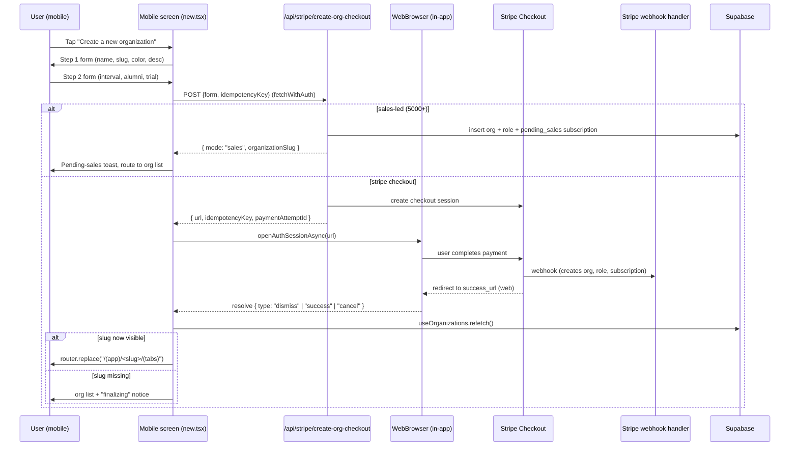

# feat: Create organizations in mobile app without web routing

## Summary

Replace the two "Create a new organization" entry points in mobile (`OrgSwitcherActions`, drawer-index empty/list states) with a native multi-step Expo Router screen that mirrors the web `/app/create-org` form, calls the existing `/api/stripe/create-org-checkout` endpoint, hands off only the Stripe Checkout step to an in-app browser (`expo-web-browser`), and reconciles state on dismiss so the user lands back inside the mobile app on the new org's home.

---

## Problem Frame

Today both mobile entry points (`apps/mobile/app/(app)/(drawer)/index.tsx` lines 180/217 and `apps/mobile/src/components/org-switcher/OrgSwitcherActions.tsx`) call `WebBrowser.openBrowserAsync` to open the web `/app/create-org` page, which forces a full context switch and shows web chrome (header, sign-out form, "Back to Organizations" link) inside a sheet. After Stripe Checkout, the success URL routes the user to `/app?org=<slug>&checkout=success` on web, not back into the mobile app — they have to dismiss, return to mobile, and pull-to-refresh the org list. Sales-led ("5000+") flow currently has no return path on mobile at all. Goal is a native form for steps 1–2 plus payment handoff that returns the user to the new org screen inside mobile.

---

## Requirements

- R1. Mobile users can complete the org-creation form (name, slug, description, brand color, billing interval, alumni bucket, optional trial) without leaving the app, with the same validation rules as web.
- R2. Stripe Checkout payment is handled by an in-app browser session and returns the user to the mobile app afterward (success or cancel).
- R3. Sales-led tier (`5000+`) completes without a Stripe session and routes the user to the org list with a pending-sales notice.
- R4. On checkout success, the new org appears in `useOrganizations()` and the user lands on its tab home (`/(app)/<slug>/(tabs)`).
- R5. The two existing "Create a new organization" entry points (drawer-index empty + list state, OrgSwitcherActions card) launch the new native screen instead of the web URL.
- R6. Slug validation, idempotency, rate limiting, free-trial gating, and pending-sales server-side behavior remain unchanged — mobile reuses the existing `/api/stripe/create-org-checkout` route as the single creation seam.

---

## Scope Boundaries

- Not building Apple IAP or Google Play Billing for org subscriptions — payment continues to flow through Stripe Checkout via in-app browser (decision confirmed with user; relies on the reader/business-tier exception that lets B2B-style admin subscriptions skirt IAP).
- Not refactoring the web `/app/create-org` page or its API contract.
- Not adding the "Join an organization" mobile parity screen — `handleJoin` continues to open web for now.
- Not replacing `expo-web-browser` with `@stripe/stripe-react-native` PaymentSheet (would bypass IAP guardrails and risk App Store rejection).
- Not changing `createOrgSchema` shape; mobile imports the same Zod schema or a thin equivalent.

### Deferred to Follow-Up Work

- Native "Join an organization" parity screen: separate plan once create-org pattern is proven.
- Universal-link / app-link configuration so the Stripe success URL can deep-link directly back to the mobile app: optional polish if dismiss-and-refetch UX proves insufficient.

---

## Context & Research

### Relevant Code and Patterns

- `apps/web/src/app/app/create-org/page.tsx` — canonical 2-step form; mirror its field set, validation, and dynamic pricing summary.
- `apps/web/src/app/api/stripe/create-org-checkout/route.ts` — server contract is unchanged; mobile POSTs the same JSON body and handles `{url}`, `{mode:"sales"}`, and 4xx error shapes.
- `apps/web/src/lib/schemas/organization.ts` — `createOrgSchema` and `CreateOrgForm`. Live in `apps/web/src/lib`, not `@teammeet/validation`. Plan moves the schema to `@teammeet/validation` so both apps share it (small refactor, scoped to this plan because mobile cannot import from `apps/web`).
- `packages/core/src/pricing/index.ts` — `BASE_PRICES`, `ALUMNI_ADD_ON_PRICES`, `ALUMNI_BUCKET_LABELS`, `getTotalPrice`, `formatPrice`. Already a shared package — mobile imports directly.
- `apps/mobile/app/(app)/(drawer)/[orgSlug]/jobs/new.tsx` — reference pattern for native multi-section form with `TextInput`, segmented controls, themed styles, `useThemedStyles`, sheet header with Cancel/Save.
- `apps/mobile/src/lib/web-api.ts` — `fetchWithAuth` already attaches a refreshed Supabase access token; mobile uses it to call `/api/stripe/create-org-checkout`.
- `apps/mobile/src/components/org-switcher/OrgSwitcherActions.tsx` and `apps/mobile/app/(app)/(drawer)/index.tsx` — entry-point swap sites.
- `apps/mobile/src/hooks/useOrganizations.ts` — to invalidate / refetch after success so the new org appears.
- `apps/mobile/src/lib/google-sign-in.ts` — uses `WebBrowser.openAuthSessionAsync(url, redirectUri)` and resolves on redirect; close model for the checkout handoff.
- `apps/mobile/src/lib/deep-link.ts` — unified intent router; can be extended with a `checkout-return` intent if a true deep-link return is added later (deferred).

### Institutional Learnings

- `docs/plans/2026-04-26-001-feat-mobile-oauth-parity-with-web-plan.md` — prior precedent for "replace web-routed flow with native + in-app-browser handoff." Mirror its structure for handoff/return.
- `docs/plans/2026-04-26-002-feat-mobile-native-upgrade-plan.md` — adjacent: native upgrade flow may already include a Stripe-Checkout-in-WebBrowser pattern; reuse if present.

### External References

- Apple App Review Guidelines 3.1.3(b) "Multiplatform Services" — admin/team-purchase subscriptions sold to organizations (not consumers) are typically allowed outside IAP. Org admins paying for their team falls into this lane; document the rationale in the PR for review.

---

## Key Technical Decisions

- **Use `WebBrowser.openAuthSessionAsync` for Stripe Checkout handoff, not `openBrowserAsync`.** `openAuthSessionAsync` resolves a promise on dismiss/redirect and returns `{type: "success" | "cancel" | "dismiss"}`, giving us a clean point to refetch orgs and route the user. `openBrowserAsync` does not resolve on dismiss reliably across iOS/Android.
- **Reconcile post-checkout by refetch + slug match, not deep-link return.** Stripe's success URL stays `https://www.myteamnetwork.com/app?org=<slug>&checkout=success` (unchanged on the server). On `WebBrowser` dismiss, mobile calls `useOrganizations.refetch()`; if the new slug appears, `router.replace("/(app)/<slug>/(tabs)")`. If it does not (webhook lag or user closed mid-checkout), surface "We're finalizing your organization. Pull to refresh in a moment." on the org list. Avoids universal-link / scheme configuration in this plan.
- **Move `createOrgSchema` to `@teammeet/validation`.** Mobile cannot import from `apps/web/src/lib`. Smallest viable share: relocate the schema and re-export from web. Keeps a single source of truth for field shape and validation.
- **Reuse server route as-is.** `/api/stripe/create-org-checkout` already enforces rate limit, idempotency, slug uniqueness, trial gating, and sales-led branching. Mobile is a second client of the same contract, not a new contract.
- **Native form sections, not steps via separate screens.** Match web's two-step flow with a single screen using a `step` state (1: org details, 2: plan & billing) — same UX, single Expo Router file, easier sheet presentation. Use Cancel header on step 1, Back on step 2.
- **Idempotency key persists in `AsyncStorage`, scoped by user + form fingerprint.** Mirrors the web `useIdempotencyKey` hook. Build a small mobile equivalent rather than try to share the web hook (web hook depends on `localStorage`).

---

## Open Questions

### Resolved During Planning

- *Payment path on iOS:* Native form + Stripe Checkout in in-app browser (user-confirmed). IAP is out of scope.
- *Schema sharing:* Move `createOrgSchema` to `@teammeet/validation` rather than duplicate.
- *Return-to-app mechanism:* `openAuthSessionAsync` dismiss + slug-match refetch (no deep-link wiring required this plan).

### Deferred to Implementation

- *Exact mobile idempotency-storage key shape:* tighten during U3 once the form fingerprint is settled.
- *Sales-led success copy and routing target:* match web tone; finalize during U2.
- *Whether `useOrganizations` already refetches on focus enough to make manual refetch redundant:* check during U5.

---

## High-Level Technical Design

> *This illustrates the intended approach and is directional guidance for review, not implementation specification. The implementing agent should treat it as context, not code to reproduce.*

---

## Implementation Units

- U1. **Move `createOrgSchema` into shared validation package**

**Goal:** Make the Zod schema importable by both web and mobile so both clients validate identically.

**Requirements:** R1, R6

**Dependencies:** None

**Files:**
- Create: `packages/validation/src/schemas/organization.ts`
- Modify: `packages/validation/src/index.ts` (re-export)
- Modify: `apps/web/src/lib/schemas/organization.ts` (re-export from `@teammeet/validation` to keep existing imports working)
- Test: `packages/validation/src/schemas/__tests__/organization.test.ts` *(create if absent; otherwise extend the closest existing schema test)*

**Approach:**
- Lift `createOrgSchema`, `alumniBucketSchema`, `subscriptionIntervalSchema`, and their inferred types into `@teammeet/validation`.
- Keep the web `apps/web/src/lib/schemas/organization.ts` file but turn it into a thin re-export of the moved symbols plus the `orgSettingsSchema` that should stay web-side (logo URL handling depends on web URL plumbing).
- No behavior change.

**Patterns to follow:**
- `packages/validation/src/schemas/common.ts` (`baseSchemas`, `safeString`, `optionalSafeString`, `hexColorSchema`).

**Test scenarios:**
- Happy path: `createOrgSchema.parse(validForm)` returns the same shape it returns today.
- Edge case: empty `description` parses to `undefined` (existing behavior).
- Error path: invalid slug (`"BadSlug!"`), invalid hex color, invalid alumni bucket — each rejects with the same message strings the web form currently surfaces.
- Edge case: `withTrial: true` with `alumniBucket: "5000+"` parses cleanly at schema level (server enforces the trial-eligibility rule via `getOrgFreeTrialRequestError`, not the schema).

**Verification:**
- Web `apps/web/src/app/app/create-org/page.tsx` still imports `createOrgSchema` (via the re-export) and behaves unchanged.
- `bun run typecheck` clean across packages, web, mobile.

---

- U2. **Native `CreateOrgScreen` with Step 1 (org details) and Step 2 (plan & billing)**

**Goal:** Build the form UI with parity to web — name, auto-generated slug, description, brand color picker, billing interval segmented control, alumni bucket select, optional trial toggle, dynamic pricing summary.

**Requirements:** R1, R3

**Dependencies:** U1

**Files:**
- Create: `apps/mobile/app/(app)/(drawer)/create-org.tsx`
- Modify: `apps/mobile/app/(app)/(drawer)/_layout.tsx` (register the new screen, hide drawer item, present as modal/page-sheet to match the rest of the auth-adjacent flows)
- Test: `apps/mobile/__tests__/screens/create-org.test.ts` *(form-state and validation logic only — RN render testing is out of scope per `apps/mobile/CLAUDE.md`)*

**Approach:**
- Two-step flow gated by `step` state; mirror the web copy and section order.
- Slug auto-generates from name on edit; user can override. Strip non-`[a-z0-9-]` on slug input.
- Brand color: native color picker is heavy; Phase 1 use a 6-swatch preset row + freeform `#hex` text input validated by the schema. Note the divergence from web's `<input type="color">` in the PR.
- Pricing summary computes from `BASE_PRICES`, `ALUMNI_ADD_ON_PRICES`, `getTotalPrice`, `formatPrice` from `@teammeet/core`.
- Trial toggle only renders when `isOrgFreeTrialSelectable({billingInterval, alumniBucket})` — import that helper or copy its tiny rule into core.
- 5000+ banner identical to web copy.
- Uses `useThemedStyles`, `TYPOGRAPHY`, `SPACING/RADIUS`, sheet header pattern from `jobs/new.tsx`.

**Patterns to follow:**
- `apps/mobile/app/(app)/(drawer)/[orgSlug]/jobs/new.tsx` for layout and theming.
- `apps/web/src/app/app/create-org/page.tsx` for field copy, validation messages, and pricing summary.

**Test scenarios:**
- Happy path: name "Stanford Crew" auto-generates slug `stanford-crew`; user override sticks until name change.
- Edge case: slug input with uppercase + special chars normalizes to lowercase + hyphens.
- Edge case: switching `billingInterval` from `month`→`year` while `alumniBucket = "none"` keeps trial toggle visible; switching to `alumniBucket = "5000+"` hides trial toggle and shows sales-led banner.
- Error path: blank name on Next press shows inline error and stays on step 1.
- Edge case: `getTotalPrice("month", "5000+")` returns null → pricing card shows custom-quote copy, not numeric total.

**Verification:**
- All field validations mirror web (verified by parsing form state through the same `createOrgSchema`).
- Visual review on iOS + Android dev clients matches the dark/light treatment of `jobs/new.tsx`.

---

- U3. **Submit handler: idempotency, `fetchWithAuth` POST, response branching**

**Goal:** Wire the Step 2 submit button to the existing `/api/stripe/create-org-checkout` route with a stable idempotency key and branch on the response.

**Requirements:** R2, R3, R6

**Dependencies:** U2

**Files:**
- Create: `apps/mobile/src/hooks/useCreateOrgIdempotencyKey.ts`
- Modify: `apps/mobile/app/(app)/(drawer)/create-org.tsx` (wire submit)
- Test: `apps/mobile/__tests__/hooks/useCreateOrgIdempotencyKey.test.ts`

**Approach:**
- `useCreateOrgIdempotencyKey({fingerprint})` hook persists key in `AsyncStorage` under `create-org-checkout:<userId>:<fingerprintHash>`. Mirrors web `useIdempotencyKey`.
- Submit handler:
  - If `idempotencyKey` not yet hydrated, surface "Preparing checkout… try again."
  - POST `/api/stripe/create-org-checkout` via `fetchWithAuth` with the same body shape as web.
  - On `{mode: "sales"}` → toast + `router.replace("/(app)/(drawer)")` with a pending-sales banner state.
  - On `{url}` → hand to U4 (open in WebBrowser).
  - On 4xx/5xx → display server-provided `error` string; on rate-limit (429) show retry-after copy.
- Map slug-collision (409 "Slug is already taken") into an inline error on the slug field and bounce back to Step 1.

**Patterns to follow:**
- `apps/mobile/src/lib/web-api.ts` `fetchWithAuth` for auth header + token refresh.
- Existing mobile error-banner conventions in `jobs/new.tsx`.

**Test scenarios:**
- Happy path: stable form fingerprint returns the same idempotency key across renders.
- Edge case: changing any form field rotates the fingerprint and yields a new key.
- Edge case: same fingerprint after app restart returns the cached key (AsyncStorage hit).
- Error path: 409 slug-taken → inline error, step bounces to 1, key preserved.
- Error path: 429 rate-limit → user-facing message includes retry guidance.
- Integration: sales-led path returns `mode: "sales"` and triggers route-to-list with banner state.

**Verification:**
- A duplicate POST with the same fingerprint reuses the same `payment_attempt`, confirmed against the server idempotency contract.

---

- U4. **Stripe Checkout handoff via `openAuthSessionAsync` and post-dismiss reconciliation**

**Goal:** Open the returned Stripe Checkout URL in the in-app browser, await dismiss, then refetch orgs and route the user.

**Requirements:** R2, R4

**Dependencies:** U3

**Files:**
- Modify: `apps/mobile/app/(app)/(drawer)/create-org.tsx`
- Modify: `apps/mobile/src/hooks/useOrganizations.ts` *(only if it lacks an external `refetch` — verify and add if missing; otherwise no change)*
- Test: `apps/mobile/__tests__/screens/create-org-handoff.test.ts` *(pure-logic reconciliation: given a refetch result, choose route)*

**Approach:**
- On `{url}` from U3, call `WebBrowser.openAuthSessionAsync(url, getWebRoute("/app"))`. The `redirectUri` is the success/cancel URL prefix; iOS and Android dismiss when the WebView lands on it.
- Promise resolves with `{type}`. Handle:
  - `success` (matched the redirect) → call `useOrganizations.refetch()`.
  - `cancel` → toast "Checkout canceled" and stay on the create-org screen at step 2 with the form preserved.
  - `dismiss` (user swiped away) → still call `refetch()` because the webhook may have completed.
- After refetch, look up the new slug. If present → `router.replace(\`/(app)/\${slug}/(tabs)\`)`. If absent → route to `/(app)/(drawer)` with a banner: "We're finalizing your organization — pull to refresh in a moment."
- Always reset the idempotency key (rotate fingerprint by clearing `AsyncStorage` entry) on success so the next creation starts fresh.

**Patterns to follow:**
- `apps/mobile/src/lib/google-sign-in.ts` (`openAuthSessionAsync` redirect-await pattern).

**Test scenarios:**
- Happy path: refetch returns the new slug → router replaces to its tab home.
- Integration: webhook lag scenario — refetch does not return the new slug → user lands on org list with finalizing banner; subsequent pull-to-refresh surfaces the org. Verified in dev with a delayed webhook fixture.
- Edge case: user cancels Stripe Checkout → no org created, form preserved, idempotency key intact for retry.
- Error path: `openAuthSessionAsync` rejects (browser plugin missing) → fall back to `openBrowserAsync` and surface "Complete checkout in browser, then return to the app."
- Integration: returning user with a pending payment attempt and the same fingerprint reuses the same checkout URL (server idempotency).

**Verification:**
- iOS + Android dev client: full flow from form → Stripe test card → return to mobile org tab home, with no app restart required.

---

- U5. **Swap entry points to launch the native screen**

**Goal:** Both existing "Create a new organization" buttons route to the new native screen rather than the web URL.

**Requirements:** R5

**Dependencies:** U4

**Files:**
- Modify: `apps/mobile/src/components/org-switcher/OrgSwitcherActions.tsx`
- Modify: `apps/mobile/app/(app)/(drawer)/index.tsx`
- Modify: `apps/mobile/__tests__/lib/web-api.test.ts` *(only the assertion that asserts mobile uses the web `/app/create-org` route — flip or remove)*

**Approach:**
- Replace `openInApp("/app/create-org")` and `openWebOnboardingRoute("/app/create-org")` with `router.push("/(app)/(drawer)/create-org")`.
- Update the accessibility labels (drop "(opens web)") and remove the `ExternalLink` icon since the action is now in-app.
- Leave `handleJoin` / `/app/join` web-routed (out of scope).

**Patterns to follow:**
- Existing in-app navigation in the same files (`router.push`, `router.replace`).

**Test scenarios:**
- Happy path: Pressing "Create a new organization" in the drawer org-switcher pushes the create-org route.
- Happy path: Same action from the empty-state and list-state cards in `(app)/(drawer)/index.tsx`.
- Edge case: `handleJoin` still opens the web `/app/join` URL (regression guard — the join entry point is intentionally untouched).

**Verification:**
- Manual smoke on dev client: both entry points open the native screen.
- Existing `web-api.test.ts` updated and green.

---

- U6. **Pending-sales return state on org list**

**Goal:** Surface a small banner on the org list when the user just completed the sales-led path so they understand status.

**Requirements:** R3

**Dependencies:** U3, U5

**Files:**
- Modify: `apps/mobile/app/(app)/(drawer)/index.tsx`

**Approach:**
- When create-org returns `mode: "sales"`, navigate with a search param (e.g., `?pendingSales=<slug>`); the org list reads `useGlobalSearchParams` (already in use) and renders an `InlineBanner`-style notice "Your organization <name> is awaiting custom-pricing setup — we'll be in touch."
- Banner auto-dismisses after a manual close or on next focus.

**Patterns to follow:**
- Existing `useGlobalSearchParams` usage in the same file (`currentSlug` handling).

**Test scenarios:**
- Happy path: arriving with `?pendingSales=foo` shows the banner with the slug-derived name fallback.
- Edge case: arriving without the param renders no banner.

**Verification:**
- Sales-led submission lands on the org list with the banner visible; navigating away and back clears the param and the banner.

---

## System-Wide Impact

- **Interaction graph:** `useOrganizations` hook is now invoked from a new screen and depends on `refetch()` being callable externally. `expo-web-browser` `openAuthSessionAsync` becomes the third use site (after Google Sign-In and OAuth callback) so its return-shape handling is now load-bearing in three places.
- **Error propagation:** Server errors from `/api/stripe/create-org-checkout` (rate limit, validation, slug collision, idempotency conflict, sales-led DB failure) all need user-readable messaging in mobile. Inline errors for field-level (slug); banners for transport-level.
- **State lifecycle risks:** Idempotency key in `AsyncStorage` must be rotated on success; otherwise the next creation reuses a completed payment_attempt and confuses the server. Sales-led path has no Stripe artifact and must not allocate or persist an idempotency key.
- **API surface parity:** Mobile becomes a second client of `/api/stripe/create-org-checkout`. Any future server-side schema change must be reflected in `@teammeet/validation` and both clients, not just web.
- **Integration coverage:** The webhook → DB path is unchanged but now feeds two clients. Mobile success path depends on `organizations` row visibility within ~2–5s of Stripe success_url redirect; if webhook latency exceeds this, the "finalizing" banner is the safety net.
- **Unchanged invariants:** `/api/stripe/create-org-checkout` body shape, validation rules, rate limits, idempotency storage, slug uniqueness, trial gating, sales-led DB writes, Stripe success_url, webhook handler, `payment_attempts` table — all unchanged.

---

## Risks & Dependencies

| Risk | Mitigation |
|------|------------|
| Apple App Review rejects the build because Stripe Checkout (external payment) is used for what reviewers classify as a consumer subscription. | Document in PR + App Store reviewer notes that org subscriptions are admin/team purchases (B2B), not consumer subscriptions. If rejected, fall back to "sales-led only on iOS" by hiding the paid tiers in the mobile form on iOS — small follow-up change. |
| `openAuthSessionAsync` does not resolve cleanly when the redirect lands on an external HTTPS URL Stripe controls (the success_url is on `myteamnetwork.com`, not a mobile-owned scheme). | Use the web origin as `redirectUri`; on iOS this matches via host comparison. If unreliable in practice, add a thin `/app/checkout-return?slug=…` page on web that 200s with a known body, used purely as the dismiss anchor — minor web-side addition during U4. |
| Webhook lag means the org row is not yet visible when refetch runs after success. | Finalizing banner + pull-to-refresh covers it; optionally retry refetch with backoff (200ms → 1s → 3s) before falling back to the banner. |
| Idempotency key collision across users on shared devices. | Storage key includes `userId` so different signed-in users do not share keys. |
| Form fingerprint instability (e.g., trimming whitespace differently between renders) causes spurious key rotation. | Mirror web's `JSON.stringify` fingerprint precisely; cover with U3 unit tests. |

---

## Documentation / Operational Notes

- Update `apps/mobile/CLAUDE.md` "Routing" or a new "In-app payment handoff" note covering the `openAuthSessionAsync` + dismiss-and-refetch pattern, since this becomes the reference implementation for future paid flows (e.g., upgrade, donations).
- App Store reviewer notes: add a paragraph explaining org subscriptions are admin/team purchases handled via Stripe Checkout in a Safari View Controller, not consumer in-app subscriptions, citing guideline 3.1.3(b).
- No env var or config changes required — `EXPO_PUBLIC_WEB_URL` already covers the API and redirect origin.

---

## Sources & References

- Web entry: `apps/web/src/app/app/create-org/page.tsx`
- Server contract: `apps/web/src/app/api/stripe/create-org-checkout/route.ts`
- Shared schema (current): `apps/web/src/lib/schemas/organization.ts`
- Shared pricing (already shared): `packages/core/src/pricing/index.ts`
- Mobile entry points: `apps/mobile/src/components/org-switcher/OrgSwitcherActions.tsx`, `apps/mobile/app/(app)/(drawer)/index.tsx`
- Mobile form pattern reference: `apps/mobile/app/(app)/(drawer)/[orgSlug]/jobs/new.tsx`
- Browser handoff reference: `apps/mobile/src/lib/google-sign-in.ts`
- Prior parity precedent: `docs/plans/2026-04-26-001-feat-mobile-oauth-parity-with-web-plan.md`
